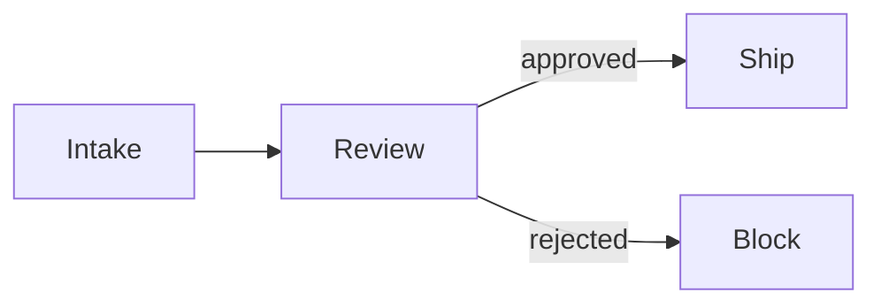

# matplotlib figure conventions — `anvil:deck`

This file is consumed by `deck-figures` (when it runs `figures/src/*.py` scripts
to render matplotlib charts) and by the `deck-vision` critic (when it scores the
rendered vision dimensions: v3 `axis_legibility`, v4 `palette_adherence`, and v5
`mathtext_artifacts`). It is the **matplotlib** side of the deck asset pipeline.
The **MathJax / mermaid** side — inline `$...$` math and fenced ```mermaid
diagrams in `deck.md` — lives in `assets/marp-renderer.md`. The two cross-
reference each other; neither duplicates the other.

A matplotlib chart in a fundraising deck has to survive two things the source-
only critics never look at: a projector at the back of a conference room, and a
Marp theme it composites onto. The conventions below exist so a chart written by
a drafter and rendered by `deck-figures` reads cleanly in both, and so the
`deck-vision` critic has nothing to flag.

## 1. Dollar signs and mathtext

matplotlib parses `$...$` in **every** text element as math mode (mathtext). A
label written as a plain Python string —

```python
ax.set_title("Oura $11B / Whoop $10.1B")
```

— renders as `Oura 11B/Whoop10.1B`: the dollar signs are swallowed as math
delimiters, and the text between them is set in italic math font with the
inter-letter spacing collapsed. On a financial slide this is not a cosmetic
glitch; the `$` carries the meaning (these are dollar amounts), and dropping it
changes what the slide says.

**Fix: escape every literal `$` as `\$`** in every text element a chart
produces — `set_xlabel`, `set_ylabel`, `set_title`, per-bar annotations,
legend entries, and any tick labels you format yourself. Use a raw f-string so
the backslash reaches matplotlib intact:

```python
label = rf"\${v / 1000:.1f}B"          # -> "$11.0B", literal dollar sign
ax.set_title(rf"Oura \$11B / Whoop \$10.1B")
ax.annotate(rf"\${row.arr_m:.1f}M", (x, y))
ax.set_ylabel(r"Revenue (\$M)")
```

The rule is per-element and per-string: a `$` anywhere in any string handed to
matplotlib needs the escape, including inside an f-string interpolation result.

### Anti-pattern: do NOT disable mathtext globally

The tempting shortcut is to turn math parsing off for the whole figure:

```python
plt.rcParams["text.parse_math"] = False    # DO NOT DO THIS
```

This breaks the log-axis `LogLocator` / `LogFormatter`. matplotlib's own
log-scale tick formatter emits its tick labels **as mathtext** — `$\mathdefault{10^{1}}$`,
`$\mathdefault{10^{2}}$`, and so on — to get the superscript exponents. With
`text.parse_math = False`, those tick labels stop being interpreted as math and
render as the literal LaTeX source string `$\mathdefault{10^{1}}$` on the axis.
So the global switch trades one rendering bug (swallowed `$` in your own labels)
for a worse one (every log-axis tick printed as raw LaTeX). Escape per-string
with `\$` instead; it is the only approach that leaves the formatter's own
mathtext untouched.

## 2. DPI and figure size

Charts are projected, not read on a laptop. Legibility is a function of
`figsize × dpi`, not DPI alone, so set both:

- **`figsize=(12, 7)`** — the shipped convention for slide-scale charts (wide
  enough to fill a 16:9 content area without the figurer up-scaling a small
  image).
- **200 DPI is the recommended default** for `savefig`. It gives crisp labels at
  projection scale.
- **150 DPI is the hard floor.** Below 150 the `deck-vision` v3 `axis_legibility`
  dimension starts flagging charts as illegible at projection scale. The shipped
  example scripts in `commands/deck-figures.md` and `assets/marp-renderer.md` use
  `dpi=150` — that is the floor, not a target; prefer 200 for new charts.

```python
fig, ax = plt.subplots(figsize=(12, 7), dpi=120)   # display dpi for layout
fig.savefig(OUT, dpi=200, bbox_inches="tight", transparent=True)
```

`bbox_inches="tight"` trims surrounding whitespace so the chart fills the slide
region; it also reduces the chance of label cropping (`deck-vision` v2).

## 3. Palette

Figures should track the Marp theme so a chart does not look pasted-in next to
the slide chrome. **Don't copy hex values by hand** — import the canonical
palette from `anvil/lib/figures/palette.py`, which mirrors
`anvil/skills/deck/assets/anvil-deck.css` `:root` (a drift-detection test keeps
the two in sync, so the imported tokens are never stale).

**The zero-effort default — call `apply()`.** It `plt.style.use`-es the shipped
`anvil.mplstyle`, which sets a navy-first series `prop_cycle`, the brand ink/rule
axis colors, Helvetica font, 200 DPI, and transparent `savefig`. A chart that
just calls `apply()` is on-brand with no per-series color bookkeeping:

```python
from anvil.lib.figures.palette import apply
apply()                       # navy-first prop_cycle, ink/rule axes, 200 DPI, transparent
```

**Explicit per-series colors — import the named tokens** when a chart assigns
colors deliberately (a "hero" series in navy, a secondary series in muted grey):

```python
from anvil.lib.figures.palette import (
    ANVIL_NAVY,    # --anvil-accent #1f4e7a — primary / hero series
    ANVIL_INK,     # --anvil-text   #1a1a1a — labels, ticks, titles, annotations
    ANVIL_MUTED,   # --anvil-muted  #6b6b6b — secondary series, de-emphasized
    ANVIL_RULE,    # --anvil-rule   #d6d6d6 — spines, light gridlines, baselines
    ANVIL_RAMP,    # navy-anchored multi-series ramp (navy first)
)
```

For reference, the tokens map to the deck theme's CSS custom properties:

| Role | Python token | CSS custom property | Hex | matplotlib use |
|---|---|---|---|---|
| Accent | `ANVIL_NAVY` | `--anvil-accent` | `#1f4e7a` | Primary series, emphasis bars, the one "hero" data series |
| Ink / text | `ANVIL_INK` | `--anvil-text` | `#1a1a1a` | Axis labels, tick labels, titles, annotations |
| Muted | `ANVIL_MUTED` | `--anvil-muted` | `#6b6b6b` | Secondary series, gridlines, de-emphasized labels |
| Rule | `ANVIL_RULE` | `--anvil-rule` | `#d6d6d6` | Light gridlines, axis spines, baselines |
| Section bg | `ANVIL_BG_SECTION` | `--anvil-bg-section` | `#f5f5f5` | Fill only if a chart must composite onto a `_class: section` / `_class: appendix` slide instead of staying transparent |

Default matplotlib colors (the `C0`/`C1` tab10 cycle, the default `#1f77b4`
blue) are a `deck-vision` v4 `palette_adherence` finding — calling `apply()` or
setting colors from the tokens above prevents it.

**Consumer theme overrides:** the canonical tokens are sourced from the shipped
`anvil-deck.css`. A consumer who overrides the theme via
`.anvil/skills/deck/templates/<their-theme>.css` should re-read their own
`:root` block and use those values — do not hard-code the shipped palette into a
chart for a deck on a custom theme.

### Bare `python3` from a thread directory: use the JSON sibling

The `from anvil.lib.figures.palette import ...` snippet above assumes Anvil is
on `sys.path` (the case in Anvil's own test suite, and in consumer repos that
`uv pip install -e <anvil-checkout>`). **In the default consumer install
topology — `<repo>/.anvil/anvil/lib/figures/palette.py` — bare `python3 figures/src/
<name>.py` cannot import it**: `.anvil/` is not on `PYTHONPATH`, so the import
raises `ModuleNotFoundError: No module named 'anvil'`.

For figure scripts that will be run via bare `python3` (the canonical
`deck-figures` invocation path), use the **JSON-read pattern** instead.
`anvil/lib/figures/palette.json` ships alongside `palette.py` with the same
hex constants; a drift test keeps the two in sync. Reading it needs no
`sys.path` plumbing — just a path walk up from `__file__` to the `.anvil/`
ancestor:

```python
import json
import matplotlib.pyplot as plt
from pathlib import Path


def _find_anvil_root(start: Path) -> Path:
    """Walk up from ``start`` until a ``.anvil/anvil/lib/figures/palette.json`` is found.

    Tolerates non-canonical thread depths — uses search-up rather than a
    hard-coded ``parents[N]`` index, so the script works from any directory
    underneath the consumer repo root.
    """
    for p in [start, *start.parents]:
        if (p / ".anvil" / "lib" / "figures" / "palette.json").is_file():
            return p / ".anvil"
    raise FileNotFoundError("could not locate .anvil/ ancestor of " + str(start))


ANVIL = _find_anvil_root(Path(__file__).resolve())
PALETTE = json.loads((ANVIL / "lib/figures/palette.json").read_text())
ANVIL_NAVY = PALETTE["ANVIL_NAVY"]
ANVIL_INK = PALETTE["ANVIL_INK"]
plt.style.use(str(ANVIL / "lib/figures/anvil.mplstyle"))
```

The `plt.style.use(...)` call gives the same on-brand defaults that
`palette.apply()` would (navy-first `prop_cycle`, 200 DPI, transparent
`savefig`, ink/rule axes) — the only thing it skips is the lazy matplotlib
import wrapper. The named tokens are read out of the JSON, not imported.

**Which path to use, when:**

| Run via | Import path works? | Use |
|---|---|---|
| `pytest` from the Anvil repo (or `uv pip install -e <anvil>`) | yes | `from anvil.lib.figures.palette import ...` |
| `python3 figures/src/<name>.py` from a consumer install | no | the JSON-read pattern above |
| `deck-figures` on a consumer install | no (bare `python3` under the hood) | the JSON-read pattern above |

When in doubt — i.e. when writing a figure script that goes into a thread
directory — use the JSON-read pattern. It works in both topologies; the
import pattern only works in one.

### Unicode glyphs (`→`, `←`, `—`, `−`) and per-glyph fallback

A chart that labels an axis or annotates a bar with `→` (U+2192) or other
non-ASCII typographic glyphs hits a matplotlib gotcha: Helvetica Neue does not
contain those glyphs, and by default matplotlib renders them as the
missing-glyph box (`☐`) and emits a `Glyph N missing from font (Helvetica
Neue)` `UserWarning` per offending glyph. The motivating case from the #74
re-render wave was a `→` between two labels on an axis tick, which showed up
in the rendered PNG as a hollow square.

**The shipped `apply()` style fixes this for free.** As of the figure-theming
follow-up to #74, `anvil.mplstyle` declares `font.family` as a concrete list
of family names — `Helvetica Neue, HelveticaNeue, Helvetica, Arial, DejaVu
Sans` — instead of the `sans-serif` alias. matplotlib 3.6+ does **per-glyph
fallback** only when `font.family` is itself a concrete list: a glyph the
primary font lacks is looked up family-by-family down the chain, and DejaVu
Sans (always bundled with matplotlib) is the universal last-resort backstop
for arrows, em dashes, the Unicode minus, and similar. The `sans-serif` alias
form — `font.family: sans-serif` plus `font.sans-serif: [list]` — silently
disables this and falls back to first-available-family-wins.

**Author rule.** If you call `apply()` near the top of your figure script
(the canonical entry point — section 6 below), you get per-glyph fallback by
default; no further action. If you override `font.family` yourself after
`apply()`, use the explicit-list form, not the alias:

```python
# OK — concrete family list, per-glyph fallback works
plt.rcParams["font.family"] = ["Helvetica Neue", "DejaVu Sans"]

# NOT OK — alias form, per-glyph fallback DISABLED
plt.rcParams["font.family"] = "sans-serif"
```

Glyphs in the same category as `→` (Helvetica Neue lacks them; DejaVu Sans
covers them all): `←` (U+2190), `↑` (U+2191), `↓` (U+2193), the em dash `—`
(U+2014), and the Unicode minus `−` (U+2212, the real minus sign that pairs
visually with `+`, as opposed to the ASCII hyphen-minus `-`).

### Semantic mermaid `classDef`s

mermaid diagrams in a deck (fenced `` ```mermaid `` blocks rendered by `mmdc`
through `anvil/lib/figures/mermaid-theme.json`) get the navy primary palette
by default. To mark individual nodes as semantically meaningful — needs
attention, complete, de-emphasized — use one of the four canonical class
names the shipped theme already ships as `classDef`s:

| Class | Semantic | Fill | Text |
|---|---|---|---|
| `anvil-accent` | "the accent one" (same as default; explicit re-statement) | `#1f4e7a` navy | white |
| `anvil-muted` | backgrounded / de-emphasized / in-review | `#6b6b6b` grey | white |
| `anvil-warning` | needs attention / rejected / failed / blocked | `#b5651d` rust | white |
| `anvil-success` | approved / complete / passed | `#2d5f3f` forest | white |

Apply with the standard `:::className` suffix on a node. **Do not hand-roll a
`classDef`** — the theme's shipped `themeCSS` already defines all four with
`!important`, so per-source `classDef foo fill:#xxx` declarations are
unnecessary at best and break the white-on-color text contract at worst (the
heirloom `consent_flow` white-on-white regression was a hand-rolled
`classDef` that set fill but not color):

````markdown

````

Authors who want to see the class names in their `.mmd` source for
self-documentation MAY also add `classDef anvil-warning fill:#b5651d` etc. —
but the shipped `themeCSS` is the source of truth for the rendered hex (the
`!important` rules in the injected `<style>` override per-source
declarations), so omitting the per-source `classDef` is the cleaner pattern.

For a one-off color outside the four semantic classes — rare — fall back to
the matching hex from `anvil/lib/figures/palette.py` (`ANVIL_NAVY_TINT` is the
only color in the figure palette without a semantic class).

## 4. Transparent backgrounds

Always save with `transparent=True`:

```python
fig.savefig(OUT, dpi=200, bbox_inches="tight", transparent=True)
```

A chart with a baked-in white background drops a white box onto any slide that
isn't pure white, which looks broken. The deck theme uses three different slide
backgrounds (all in `anvil-deck.css` `:root`):

- `--anvil-bg` `#ffffff` — default white content slides.
- `--anvil-bg-section` `#f5f5f5` — `_class: section` and `_class: appendix`
  slides.
- `--anvil-bg-ask` `#1f4e7a` (= the accent navy) — the full-bleed ask slide.

A transparent PNG composites cleanly onto all three. A chart dropped onto the
navy ask slide with an opaque white background is the most visible failure of
this rule.

## 5. Output-path discipline

A matplotlib script lives at `figures/src/<name>.py`, reads its data from a
co-located `figures/src/<name>.csv`, and writes its rendered PNG one directory
up, to `figures/<name>.png`. Derive both paths from `__file__` so the script
runs the same regardless of the working directory `deck-figures` invokes it
from:

```python
SRC = Path(__file__).parent          # figures/src/
OUT = SRC.parent / "<name>.png"      # figures/<name>.png
df  = pd.read_csv(SRC / "<name>.csv")
```

This is what lets `deck-figures` re-render deterministically and idempotently:
it compares the mtime of `figures/<name>.png` against the `.py` script and the
`.csv` data, and skips the render when the PNG is newer than both.

**Never fabricate data.** If the `.csv` a script needs does not exist, the
script should refuse rather than generate placeholder numbers — a fabricated
chart in a fundraising deck is the easiest critical flag to trigger in the audit.
Extract real numbers from the brief into a CSV first; do not inline made-up data.

### Cross-thread references — prefer `.latest` symlinks when the convention is in play

A figure script that pulls a number from a peer thread (e.g., a deck chart
referencing the latest investor memo's headline number, or a comparison
chart sourcing data from a sibling paper's tables) SHOULD reference the peer
through the optional `<thread>.latest` symlink convention rather than
hardcoding a version number:

```python
# Prefer this — stable across revisions of the peer thread:
SRC_PEER = Path("refs") / "bessemer.latest" / "exhibits" / "headline.csv"

# Avoid this — silently goes stale the next time `bessemer` is revised:
SRC_PEER = Path("refs") / "bessemer.8" / "exhibits" / "headline.csv"
```

The convention is documented in `anvil/lib/snippets/version_layout.md`
("Convenience `.latest` symlinks"). The convention is consumer-maintained
and opt-in; if the consumer has not added `.latest` symlinks to their
project, fall back to the explicit `<thread>.{N}/` path and bump it on
the next revision of the referencing chart. Do not have the chart script
itself try to resolve "latest N" — that is the symlink's job, and
duplicating the logic in chart code is what creates the staleness
the convention exists to avoid.

## 6. Canonical script template

A single minimal script demonstrating all of the above — the on-brand shared
style (`figsize=(12, 7)`, 200 DPI, `transparent=True`, ink/rule axes, and the
navy-first `prop_cycle`), palette tokens, `$`-escaping, and the `OUT =
SRC.parent / "<name>.png"` output path.

**This template uses the JSON-read pattern from section 3** so it works under
bare `python3` from a consumer install topology (`<repo>/.anvil/anvil/lib/figures/
palette.json`). The Python-import variant (`from anvil.lib.figures.palette
import apply, ANVIL_NAVY, ANVIL_INK; apply()`) is a one-line substitution if
your environment has Anvil on `sys.path`; see the table in section 3 for when
each path applies.

```python
#!/usr/bin/env python3
"""figures/src/traction.py — ARR bars, one hero series.

Reads figures/src/traction.csv (columns: quarter, arr_m).
Writes figures/traction.png.
"""
import json
import matplotlib.pyplot as plt
import pandas as pd
from pathlib import Path

# --- shared on-brand style (section 3): JSON-read pattern for bare python3.
#     Walks up from __file__ until it finds a .anvil/ ancestor — tolerates
#     non-canonical thread depths.
def _find_anvil_root(start: Path) -> Path:
    for p in [start, *start.parents]:
        if (p / ".anvil" / "lib" / "figures" / "palette.json").is_file():
            return p / ".anvil"
    raise FileNotFoundError("could not locate .anvil/ ancestor of " + str(start))

ANVIL = _find_anvil_root(Path(__file__).resolve())
PALETTE = json.loads((ANVIL / "lib/figures/palette.json").read_text())
ANVIL_NAVY = PALETTE["ANVIL_NAVY"]
ANVIL_INK = PALETTE["ANVIL_INK"]
plt.style.use(str(ANVIL / "lib/figures/anvil.mplstyle"))   # navy-first prop_cycle, 200 DPI, transparent, ink/rule axes

# --- output-path discipline (section 5) ---
SRC = Path(__file__).parent
OUT = SRC.parent / "traction.png"
df = pd.read_csv(SRC / "traction.csv")   # no data file -> let pandas raise, never fabricate

fig, ax = plt.subplots()                 # figsize/dpi come from the mplstyle

ax.bar(df["quarter"], df["arr_m"], color=ANVIL_NAVY)   # explicit hero series

# --- $-escaping: every literal $ is \$ (section 1) ---
ax.set_title(r"ARR by quarter (\$M)")
ax.set_xlabel("Quarter")
ax.set_ylabel(r"ARR (\$M)")
for x, v in zip(df["quarter"], df["arr_m"]):
    ax.annotate(rf"\${v:.1f}M", (x, v), ha="center", va="bottom", color=ANVIL_INK)

fig.tight_layout()
# --- savefig: 200 DPI + transparent come from the mplstyle ---
fig.savefig(OUT)
```

## 7. What the `deck-vision` critic catches

These conventions exist to prevent the rendered-pixel defects the `deck-vision`
critic scores. This section points at the detection; it does not re-specify it —
see `commands/deck-vision.md` for the dimension definitions:

- **Mathtext artifacts** — `deck-vision` v5 `mathtext_artifacts` flags italic
  letters adjacent to dollar signs and literal LaTeX source on the chart. When a
  swallowed `$` changes the meaning of a financial slide, it escalates to the
  critical flag `mathtext_artifact_breaks_meaning`. Section 1 is the prevention.
- **Off-palette colors** — `deck-vision` v4 `palette_adherence` flags default
  matplotlib colors that don't match the theme palette. Section 3 is the
  prevention.
- **Sub-150-DPI / illegible labels** — `deck-vision` v3 `axis_legibility` flags
  charts whose axis and tick labels are illegible at projection scale. Sections
  2 (DPI/figsize) and 3 (ink color) are the prevention.
- **Label cropping** — `deck-vision` v2 `label_cropping` flags axis labels,
  legends, or annotations truncated by the figure border. `bbox_inches="tight"`
  (section 2) is the prevention.

`deck-design` (rubric dimension 8) owns general image quality — pixelation and
palette *consistency across slides* — but the per-chart mathtext, palette-hex,
and legibility specifics live in `deck-vision`.

## 8. Why is my slide visibly small? (Marp silent auto-shrink)

A slide whose figure and bullets occupy maybe 40% of slide height when peer
slides fill 85% is almost never an authoring mistake — it is Marp's CSS
`fit-to-frame` rule kicking in. When a `<section>` is over-budget by a small
amount, Marp doesn't always clip; it sometimes silently scales the whole
frame to fit. Two or three auto-shrunk slides in a deck read as
"unfinished" even though the markdown source is clean and the PDF opens
without warnings.

This is harder to catch than loud overflow (the source-side `marp_lint`
`slide-content-overflow` rule covers that — see section 7 above). The
silent variant only becomes obvious when you put the shrunk slide next to a
peer slide that wasn't shrunk; the type-size delta is the tell. A reader
without the comparison just assumes the slide was meant to read that small.

**The lint that catches it.** `deck-review` runs a deterministic
post-render detector (`anvil/skills/deck/lib/auto_shrink_detector.py`,
issue #102 / #100b) that renders `deck.pdf` to per-page PNGs, computes a
content bounding box per page from pixel-diff against the corner-sampled
background, classifies each slide by `<!-- _class: ... -->` directive
(defaulting to `content`), and emits an `auto-shrink-fit-compression`
finding for any page whose bottom margin exceeds BOTH 1.5× the per-class
median AND 18% of slide height. Singleton-class slides (typically one
`title`, one `ask`) are skipped — too few peers for a median. The check
is optional at the framework level (needs `Pillow` + `numpy`, opt-in via
`uv pip install -e .[auto_shrink]`); when the deps aren't installed,
`deck-review` records an info-level skip note and proceeds.

**Remediation.** Trim 10–20 words from the densest element on the slide,
or move one bullet (or one body paragraph) to a peer slide. The
[slide-archetypes budget guidance](#slide-archetypes) — under the
`marp_lint` doc — is the source-side analogue: stay within the word
budget the archetype documents and Marp won't have anything to scale.

**Why not just rely on `deck-vision`?** The vision critic's
`v1 vertical_overflow` dimension is the qualitative VLM companion ("does
this look bad?"), but every invocation costs an API call. The deterministic
detector is free per page (~50ms at 150 DPI) and runs every review; the
VLM rubric is for content judgements the detector can't make ("is this
the *right* density of content for the slide's role?").

**Why not extend `marp_lint`?** That module is intentionally source-side
only (Python port of marp-vscode's `slide-content-overflow` DOM
diagnostic, applied to markdown without rendering). Auto-shrink is a
post-render symptom — by the time you can measure it, the source-side
check has already passed.

## 9. See also

- `assets/marp-renderer.md` — the **mermaid / MathJax** side of the asset
  pipeline (inline `$...$` slide math is independent of the matplotlib `\$`
  escape covered here).
- `commands/deck-figures.md` — the figurer that runs these scripts and renders
  the deck PDF.
- `commands/deck-vision.md` — the vision critic that scores the rendered output
  (the detection counterpart to this prevention doc).
- `anvil/lib/figures/palette.py` — the canonical importable palette tokens
  (`ANVIL_NAVY` etc.) and `apply()` shared style referenced in sections 3 and 6;
  also the shared `anvil.mplstyle` and `mermaid-theme.json`.
- `assets/anvil-deck.css` — `:root` is the cross-format source of truth for the
  palette; `palette.py` mirrors it and a drift test keeps them in sync.
- `assets/slide-archetypes.md` — the **slide-layout** side: the figure +
  supporting-line idiom and the italic supporting-line word budget (lint rule
  `figure-italic-supporting-line-too-long` in `anvil/lib/marp_lint.py`) that
  constrains what authors write underneath a chart. The budget is stated
  there, not duplicated here — this doc is the chart-generation half of the
  pipeline; slide-archetypes is the chart-placement half.
