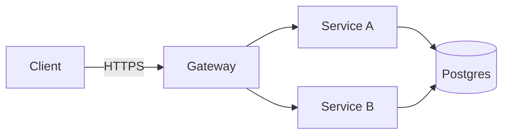

# Marp renderer cheat-sheet — `anvil:deck`

This is a one-page reference for the Marp configuration the deck skill
assumes. The framework-level pin lives at `anvil/lib/marp/config.yml` (in an
installed consumer repo: `.anvil/anvil/lib/marp/config.yml`); the per-document
pin lives in `templates/deck.md.j2`. This file is for the deck author who
just wants to know which figure path to pick and how to render the result.

## The three figure paths

`anvil:deck` ships exactly three figure paths. Use them in this order of
preference:

| Path | Source | Lives in `deck.md` as | When to use |
|---|---|---|---|
| **Matplotlib PNG** | `figures/src/<name>.py` + `figures/src/<name>.csv` | `` | Data charts (bar, line, scatter, distribution) — anything with axes and real numbers. |
| **Mermaid PNG (`mmdc`)** | `figures/src/<name>.mmd` | `` | Architecture diagrams, sequence diagrams, flowcharts, state machines. **Default for diagrams.** Requires `mmdc` (see warning below). |
| **MathJax** | Inline `$...$` or display `$$...$$` in `deck.md` | (inline source) | Any inline equation or formula. |

> **Inline ```mermaid does NOT render in the PDF (verified, issue #65).** A
> fenced ```mermaid block left in `deck.md` emits as raw monospace code in the
> canonical `--pdf` output — it is NOT turned into a diagram. `html: true` only
> passes raw HTML through; it does not execute mermaid.js during Marp's PDF
> render. Render every diagram to a PNG via `mmdc` (Path 2 below) and reference
> it as ``. `mmdc` is therefore a **required**
> dependency for any deck with a diagram, not a fallback.

Each path has one minimal worked example below.

### Path 1 — Matplotlib PNG (data charts)

`figures/src/traction.py`:

```python
#!/usr/bin/env python3
import matplotlib.pyplot as plt
import pandas as pd
from pathlib import Path

SRC = Path(__file__).parent
OUT = SRC.parent / "traction.png"

df = pd.read_csv(SRC / "traction.csv")
fig, ax = plt.subplots(figsize=(12, 7), dpi=120)
ax.plot(df["month"], df["arr_k"], marker="o")
ax.set_title("ARR growth — Q1 2025 to Q2 2026")
ax.set_xlabel("Month")
ax.set_ylabel("ARR ($K)")
fig.tight_layout()
fig.savefig(OUT, dpi=150, bbox_inches="tight")
```

In `deck.md`:

```markdown
## Traction


```

`deck-figures` runs the script and produces the PNG. Matplotlib palette,
DPI, and `$`-escaping conventions are owned by
`assets/figure-conventions.md` (cross-reference).

### Path 2 — Mermaid PNG via `mmdc` (diagrams) — **default**

Write the diagram source to `figures/src/<name>.mmd`:



In `deck.md`, reference the rendered PNG:

```markdown
## Solution architecture


```

`deck-figures` renders the `.mmd` source to a PNG with `mmdc`:

```bash
mmdc --input figures/src/architecture.mmd \
     --output figures/architecture.png \
     --width 1600 --height 900 --backgroundColor white
```

**Why not inline?** A fenced ```mermaid block left directly in `deck.md`
emits as **raw monospace code** in the canonical `--pdf` output (verified,
issue #65) — it is NOT rendered into a diagram. `--html` / `html: true` only
passes raw HTML through; it does not execute mermaid.js during Marp's PDF
render. So diagrams must be pre-rendered to PNG. If the drafter does leave an
inline ```mermaid fence (or marks one with `<!-- anvil-figure: png -->`),
`deck-figures` extracts it to `figures/src/<name>.mmd` and renders it through
this path.

**`mmdc` is required** for any deck with a diagram. It pulls Puppeteer + a
~300MB+ headless Chromium; in CI/containers it needs
`--puppeteerConfigFile` with `{"args":["--no-sandbox"]}`. `deck-figures`
preflights `mmdc` before any render and emits a `[blocker]` + proactive
`<name>.png-FAILED.md` stub if it is absent. See `commands/deck-figures.md`
step 4 for the full procedure.

### Path 3 — MathJax (equations)

In `deck.md`, directly:

```markdown
## Unit economics

Lifetime value:

$$LTV = \frac{ACV \cdot \text{retention\_years}}{\text{gross\_margin}^{-1}}$$

…where retention is measured over $n \geq 3$ cohorts.
```

That's it. Marp renders MathJax inline at PDF-export time. No preprocessing,
no `pdflatex`, no external service. MathJax (Marp v3 default) covers a
wider LaTeX subset than KaTeX — most equations a fundraising deck needs
will render without escape characters or workarounds.

`math: mathjax` is pinned in the per-document frontmatter and at the CLI
config level. The matplotlib-side `$`-escape convention (`\$` for literal
dollar signs in axis labels) is owned by `assets/figure-conventions.md`
and is independent of the slide-level math engine.

## Canonical CLI render line

```bash
marp <thread>.{N}/deck.md \
  --pdf \
  --html \
  --config-file anvil/lib/marp/config.yml \
  --theme-set anvil/skills/deck/assets/anvil-deck.css \
  --allow-local-files \
  --no-stdin \
  --output <thread>.{N}/deck.pdf
```

`--no-stdin` keeps marp-cli from blocking on an open stdin pipe in non-TTY /
agent-driven contexts, where it otherwise prints `Currently waiting data from
stdin stream` and hangs (issue #620). Anvil's canonical Python render path
(`anvil.lib.render.render_marp_to_pdf`) also passes `stdin=subprocess.DEVNULL`
for the same reason.

Three flags are load-bearing:

- `--html` lets raw HTML in the source pass through into the rendered PDF.
  Note: it does NOT make inline ```mermaid fences render as diagrams
  (verified false, issue #65) — diagrams go through `mmdc → PNG` (Path 2).
  `--html` is kept for genuine raw-HTML slides and config parity.
- `--config-file anvil/lib/marp/config.yml` pins the framework-shared
  options (`html`, `allowLocalFiles`, theme search path). Consumer repos
  resolve this to `.anvil/anvil/lib/marp/config.yml`.
- `--allow-local-files` lets Marp inline `` references.
  Without it, every embedded PNG renders as a broken-image icon. This is the
  flag that matters for the mermaid PNGs `mmdc` produces.

The explicit `--html`, `--theme-set`, and `--allow-local-files` flags are
kept on the CLI line as belt-and-suspenders so the render still does the
right thing when the config file is missing or has been overridden.

## Layout patterns

Multi-column / grid slide layouts must be applied through a class — either one
of the **stock classes shipped in `anvil-deck.css`** (`.row`, `.split`) or a
consumer-defined class declared in the deck's frontmatter `style:` block.
**Inline `style="display:grid;..."` / `style="display:flex;..."` does not
work.**

**The foreignObject SVG render constraint (verified, issue #128).** Marp
renders each slide's content into a `<foreignObject>` element inside an SVG,
then rasterizes via Chromium for the canonical `--pdf` output. Through that
path, **inline `display: grid`, `display: flex`, `display: inline-grid`, and
`display: inline-flex` styles are silently dropped**. The slide compiles
without errors, but the layout flattens to single-column stacked output in the
PDF. The browser DOM behaves correctly when previewing in `marp -s`, which
makes the trap easy to miss until the PDF is rasterized. Observed in studio's
ikebot.3 reviser (2026-05-30), which hit this three times on diptych slides
before recording the pattern.

**Does NOT render** — inline display style is dropped:

```markdown
<!-- silently flattens to single column in the PDF render -->
<div style="display: grid; grid-template-columns: 1fr 1fr; gap: 2em;">
  <div></div>
  <div></div>
</div>
```

**Does render** — `anvil-deck.css` ships `.row` (auto-flex) and `.split`
(50/50 grid) as stock theme classes; reference one of them directly from the
slide body. No frontmatter `style:` block needed for the standard cases:

```markdown
---
marp: true
size: 16:9
theme: anvil-deck
html: true
---

## Catalog vs. delivered

<div class="row">
  <div></div>
  <div></div>
</div>
```

For asymmetric ratios or other layouts the two stock classes don't cover,
fall back to a consumer-defined class in the deck's frontmatter `style:`
block — class-based selectors (whether shipped in the theme or declared in
frontmatter) apply via the global stylesheet, which the foreignObject path
**does** honor. The same approach works for `display: flex`, multi-column
grids, and `align-items` / `justify-content` rules — the constraint is on
the *inline* `style="..."` attribute specifically, not on the CSS properties
themselves. See `slide-archetypes.md` "Figure layout idioms → Custom
layouts beyond `.row` / `.split`" for the worked frontmatter example.

The deck skill ships an `inline-display-style-dropped` lint rule
(`anvil/lib/marp_lint.py`, severity `warning`) that detects the
broken pattern in `deck.md` source and suggests the class-based replacement.
The rule supports the standard per-slide escape hatch:

```markdown
<!-- anvil-lint-disable: inline-display-style-dropped -->
```

For the worked two-column / figure-left + text-right idiom, see
`slide-archetypes.md` "Figure layout idioms → Two-column."

## See also

- `anvil/lib/marp/config.yml` — canonical Marp config (single source of
  truth for the renderer pin).
- `anvil/lib/snippets/brand-theme-porting.md` — porting an existing
  consumer brand (LaTeX beamer `.sty`) onto a Marp CSS theme: starter
  template (`anvil/lib/marp/brand-theme-starter.css`), beamer-concept
  mapping table, `--theme-set` registration, and validation via the
  render gate + vision critic.
- `anvil/lib/README.md` — "Marp renderer pin" section explains what is
  pinned and why each option is load-bearing.
- `anvil/skills/deck/templates/deck.md.j2` — per-document frontmatter that
  mirrors the config-file pin.
- `anvil/skills/deck/commands/deck-figures.md` — full figure pipeline
  including the `mmdc → PNG` diagram path and the required-`mmdc` preflight.
- `anvil/lib/marp_lint.py` — `slide-content-overflow` lint that
  runs on the resulting markdown source (catches the figure + bullets + footer
  pattern that mermaid auto-layout cannot save), plus the
  `figure-italic-supporting-line-too-long` and `inline-display-style-dropped`
  rules (the latter catches the foreignObject-SVG inline-`display:` trap
  documented in "Layout patterns" above).
- `anvil/skills/deck/assets/figure-conventions.md` — matplotlib `$`-escape
  conventions, palette, DPI defaults, transparency, and output-path
  discipline (the matplotlib side of the asset pipeline; this cheat-sheet is
  the mermaid/MathJax side).
