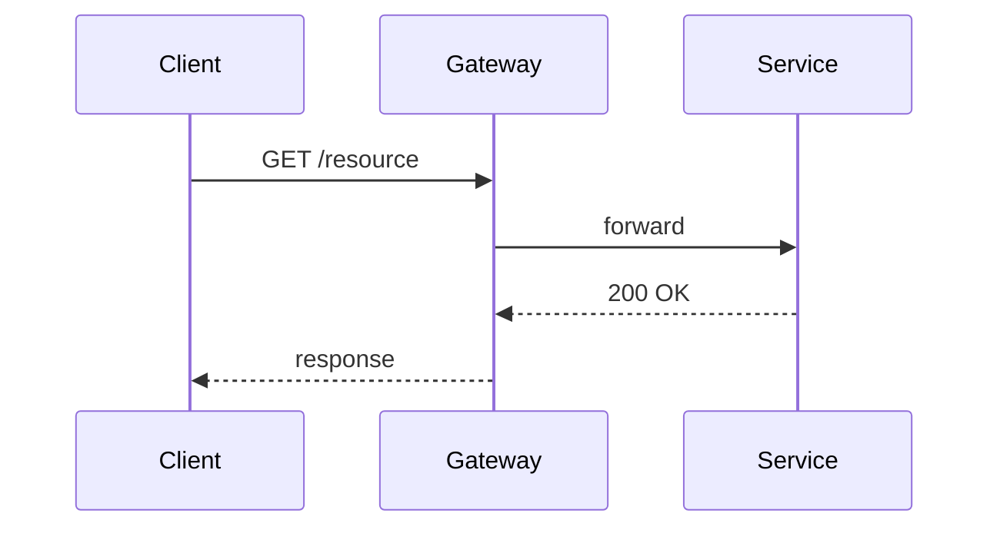

# Marp smoke fixture — deck

Minimal fixture exercising the three figure paths the Marp renderer pin
guarantees. Used by `tests/test_marp_smoke.py` (and the slides-side
mirror) to verify that the frontmatter pin is present, that the lint
agrees the slides fit the safe area, and (conditionally) that Marp CLI
renders the source without error.

---

## MathJax inline

Inline math: $\int_0^\infty e^{-x^2} \, dx = \frac{\sqrt{\pi}}{2}$.

---

## Inline mermaid

---

## MathJax + mermaid

Combined slide — both pipelines on one slide.

$\nabla \cdot \mathbf{E} = \rho / \varepsilon_0$

