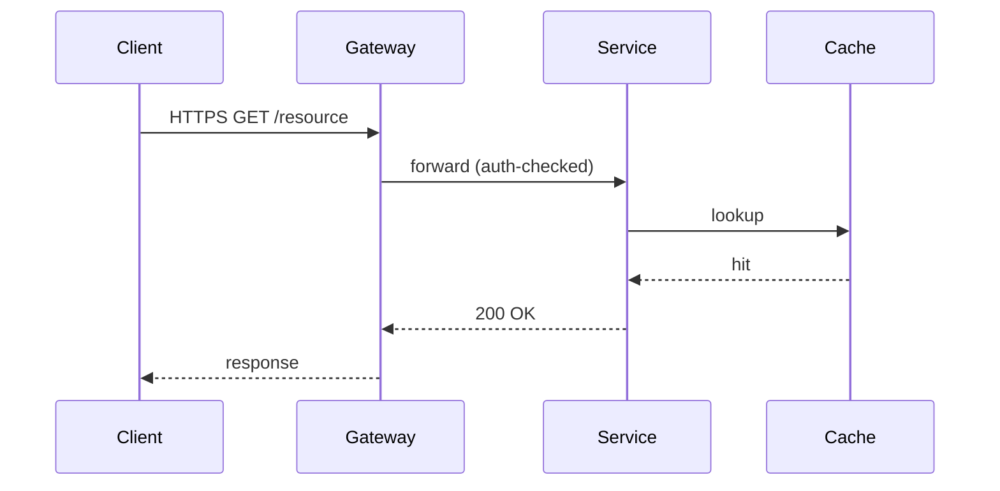

# Marp renderer cheat-sheet — `anvil:slides`

This is a one-page reference for the Marp configuration the slides skill
assumes. The framework-level pin lives at `anvil/lib/marp/config.yml` (in an
installed consumer repo: `.anvil/anvil/lib/marp/config.yml`); the per-document
pin lives in `templates/deck.md.j2`. This file is for the talk author who
just wants to know which figure path to pick and how to render the result.

## The three figure paths

`anvil:slides` ships exactly three figure paths. Use them in this order of
preference:

| Path | Source | Lives in `deck.md` as | When to use |
|---|---|---|---|
| **Matplotlib PNG** | `figures/<name>.py` + `figures/<name>.csv` | `` | Data plots (results, ablation tables, distributions, benchmark curves) — anything driven by a real dataset. |
| **Mermaid PNG (`mmdc`)** | `figures/<name>.mmd` | `` | Architecture diagrams, sequence diagrams, system flows, protocol traces, state machines. **Default for diagrams.** Requires `mmdc` (see warning below). |
| **MathJax** | Inline `$...$` or display `$$...$$` in `deck.md` | (inline source) | Theorem statements, equations, derivations, formal definitions. |

> **Inline ```mermaid does NOT render in the PDF (verified, issue #65).** A
> fenced ```mermaid block left in `deck.md` emits as raw monospace code in the
> canonical `--pdf` output — it is NOT turned into a diagram. `html: true` only
> passes raw HTML through; it does not execute mermaid.js during Marp's PDF
> render. Render every diagram to a PNG via `mmdc` (Path 2 below) and reference
> it as ``. `mmdc` is therefore a **required**
> dependency for any deck with a diagram, not a fallback.

Each path has one minimal worked example below, tuned for a talk / lecture
audience.

### Path 1 — Matplotlib PNG (data plots)

`figures/benchmark.py`:

```python
#!/usr/bin/env python3
import matplotlib.pyplot as plt
import pandas as pd
from pathlib import Path

SRC = Path(__file__).parent
df = pd.read_csv(SRC / "benchmark.csv")

fig, ax = plt.subplots(figsize=(10, 6), dpi=120)
for method in df["method"].unique():
    sub = df[df["method"] == method]
    ax.plot(sub["epoch"], sub["accuracy"], marker="o", label=method)
ax.set_xlabel("Epoch")
ax.set_ylabel("Validation accuracy")
ax.set_title("Convergence — benchmark suite, 5 seeds")
ax.legend()
fig.tight_layout()
fig.savefig(SRC / "benchmark.png", dpi=150, bbox_inches="tight")
```

In `deck.md`:

```markdown
# Results


- All three methods converge by epoch 40.
- Method C dominates on the held-out partition (p < 0.01, paired t-test).
```

`slides-figures` runs the script and produces the PNG. Matplotlib palette,
DPI, and `$`-escaping conventions (for `\$` in axis labels) are owned by
issue #23's `figure-conventions.md` (cross-reference; not yet landed).

### Path 2 — Mermaid PNG via `mmdc` (diagrams) — **default**

A sequence diagram for a protocol walkthrough. Write the source to
`figures/protocol.mmd`:



In `deck.md`, reference the rendered PNG:

```markdown
# Protocol — request lifecycle


The cache hit avoids the database round-trip; tail latency drops from 180ms
to 12ms on the p99.
```

`slides-figures` renders the `.mmd` source to a PNG with `mmdc`:

```bash
mmdc --input figures/protocol.mmd --output figures/protocol.png \
     --width 1600 --height 900 --backgroundColor white
```

**Why not inline?** A fenced ```mermaid block left directly in `deck.md`
emits as **raw monospace code** in the canonical `--pdf` output (verified,
issue #65) — it is NOT rendered into a diagram. `--html` / `html: true` only
passes raw HTML through; it does not execute mermaid.js during Marp's PDF
render. So diagrams must be pre-rendered to PNG. If a drafter leaves an inline
```mermaid fence (or marks one with `<!-- anvil-figure: png -->`),
`slides-figures` extracts it to `figures/<name>.mmd` and renders it through
this path.

**`mmdc` is required** for any deck with a diagram. It pulls Puppeteer + a
~300MB+ headless Chromium; in CI/containers it needs `--puppeteerConfigFile`
with `{"args":["--no-sandbox"]}`. See `commands/slides-figures.md` §
"Mermaid (default for diagrams)" for the full procedure.

### Path 3 — MathJax (theorem statements and equations)

A worked theorem statement, directly in `deck.md`:

```markdown
# Convergence guarantee

**Theorem (informal).** Let $f: \mathbb{R}^d \to \mathbb{R}$ be
$\beta$-smooth and $\mu$-strongly convex. Gradient descent with step
size $\eta = 1/\beta$ converges linearly:

$$\| x_t - x^\star \|_2 \leq \left( 1 - \frac{\mu}{\beta} \right)^t \| x_0 - x^\star \|_2.$$

The condition number $\kappa = \beta / \mu$ controls the rate; ill-conditioned
problems converge slowly even with the optimal step size.
```

That's it. Marp renders MathJax inline at PDF-export time. No preprocessing,
no `pdflatex`, no external service. MathJax (Marp v3 default) covers a
wider LaTeX subset than KaTeX — most theorem statements and derivations a
talk needs will render without escape characters or workarounds.

`math: mathjax` is pinned in the per-document frontmatter and at the CLI
config level. The matplotlib-side `$`-escape convention (`\$` for literal
dollar signs in axis labels) is owned by issue #23 and is independent of
the slide-level math engine.

## Canonical CLI render line

```bash
marp <thread>.{N}/deck.md \
  --pdf \
  --html \
  --config-file anvil/lib/marp/config.yml \
  --theme-set anvil/skills/slides/templates/anvil-slides-theme.css \
  --allow-local-files \
  --no-stdin \
  --output <thread>.{N}/deck.pdf
```

`--no-stdin` keeps marp-cli from blocking on an open stdin pipe in non-TTY /
agent-driven contexts, where it otherwise prints `Currently waiting data from
stdin stream` and hangs (issue #620). Anvil's canonical Python render path
(`anvil.lib.render.render_marp_to_pdf`) also passes `stdin=subprocess.DEVNULL`
for the same reason.

Three flags are load-bearing:

- `--html` lets raw HTML in the source pass through into the rendered PDF.
  Note: it does NOT make inline ```mermaid fences render as diagrams
  (verified false, issue #65) — diagrams go through `mmdc → PNG` (Path 2).
  `--html` is kept for genuine raw-HTML slides and config parity.
- `--config-file anvil/lib/marp/config.yml` pins the framework-shared
  options (`html`, `allowLocalFiles`, theme search path). Consumer repos
  resolve this to `.anvil/anvil/lib/marp/config.yml`.
- `--allow-local-files` lets Marp inline `` references.
  Without it, every embedded PNG renders as a broken-image icon. This is the
  flag that matters for the mermaid PNGs `mmdc` produces.

The explicit `--html`, `--theme-set`, and `--allow-local-files` flags are
kept on the CLI line as belt-and-suspenders so the render still does the
right thing when the config file is missing or has been overridden.

The handout exporter (`slides-handout`) uses the same invocation plus
`--pdf-notes` for the notes-below layout.

## Layout patterns

Multi-column / grid slide layouts must be defined via the deck's frontmatter
`style:` block and applied through a class, **not** through inline `style="..."`.

**The foreignObject SVG render constraint (verified, issue #128).** Marp
renders each slide's content into a `<foreignObject>` element inside an SVG,
then rasterizes via Chromium for the canonical `--pdf` output. Through that
path, **inline `display: grid`, `display: flex`, `display: inline-grid`, and
`display: inline-flex` styles are silently dropped**. The slide compiles
without errors, but the layout flattens to single-column stacked output in the
PDF. The browser DOM behaves correctly when previewing in `marp -s`, which
makes the trap easy to miss until the PDF is rasterized.

**Does NOT render** — inline display style is dropped:

```markdown
<!-- silently flattens to single column in the PDF render -->
<div style="display: grid; grid-template-columns: 1fr 1fr; gap: 2em;">
  <div></div>
  <div></div>
</div>
```

**Does render** — frontmatter `style:` block defines a class; the slide
body references the class:

```markdown
---
marp: true
size: 16:9
theme: anvil-slides
html: true
style: |
  .row { display: grid; grid-template-columns: 1fr 1fr; gap: 2em; align-items: center; }
---

## Side-by-side comparison

<div class="row">
  <div></div>
  <div></div>
</div>
```

Class-based selectors apply via the global stylesheet, which the
foreignObject path **does** honor. The same approach works for `display:
flex`, multi-column grids, and `align-items` / `justify-content` rules — the
constraint is on the *inline* `style="..."` attribute specifically, not on
the CSS properties themselves.

The slides skill ships an `inline-display-style-dropped` lint rule
(imports `anvil/lib/marp_lint.py` directly, severity `warning`) that
detects the broken pattern in `deck.md` source and suggests the class-based
replacement. The rule supports the
standard per-slide escape hatch:

```markdown
<!-- anvil-lint-disable: inline-display-style-dropped -->
```

## See also

- `anvil/lib/marp/config.yml` — canonical Marp config (single source of
  truth for the renderer pin).
- `anvil/lib/snippets/brand-theme-porting.md` — porting an existing
  consumer brand (LaTeX beamer `.sty`) onto a Marp CSS theme: starter
  template (`anvil/lib/marp/brand-theme-starter.css`), beamer-concept
  mapping table, `--theme-set` registration, and validation via the
  render gate + vision critic.
- `anvil/lib/README.md` — "Marp renderer pin" section explains what is
  pinned and why each option is load-bearing.
- `anvil/skills/slides/templates/deck.md.j2` — per-document frontmatter
  that mirrors the config-file pin.
- `anvil/skills/slides/commands/slides-figures.md` — full figure pipeline
  including the `mmdc → PNG` diagram path.
- `anvil/skills/slides/commands/slides-handout.md` — handout exporter
  using the same canonical render line.
- `anvil/lib/marp_lint.py` — `slide-content-overflow` lint
  that runs on the resulting markdown source, plus the
  `figure-italic-supporting-line-too-long`
  and `inline-display-style-dropped` rules (the latter catches the
  foreignObject-SVG inline-`display:` trap documented in "Layout patterns"
  above).
- Issue #23 — matplotlib `$`-escape conventions, palette helpers, DPI
  defaults. Lands at `anvil/skills/deck/assets/figure-conventions.md`
  (cross-reference; out of scope for this skill's renderer cheat-sheet).
