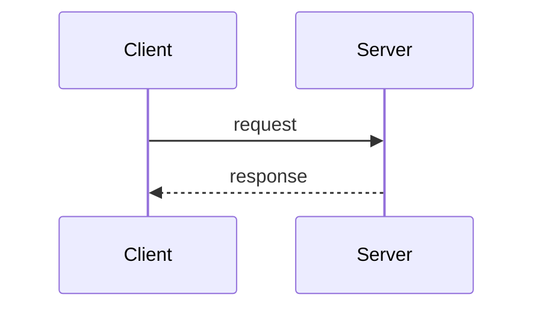
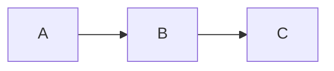

# Marp smoke fixture — slides

Minimal fixture exercising the three figure paths the Marp renderer pin
guarantees, with talk-flavored examples (theorem statement + sequence
diagram). Used by `tests/test_marp_smoke.py` (mirrored from the deck-side
fixture via the same `importlib.util.spec_from_file_location` mechanism PR
#38 established for the lint module).

---

# MathJax — theorem statement

**Theorem.** For a $\beta$-smooth, $\mu$-strongly convex $f$, gradient
descent with step $\eta = 1/\beta$ satisfies:

$$\| x_t - x^\star \|_2 \leq \left( 1 - \frac{\mu}{\beta} \right)^t \| x_0 - x^\star \|_2.$$

---

# Inline mermaid — sequence diagram

---

# MathJax + mermaid

Combined slide.

$\sigma = \sqrt{\frac{1}{n} \sum_i (x_i - \mu)^2}$

