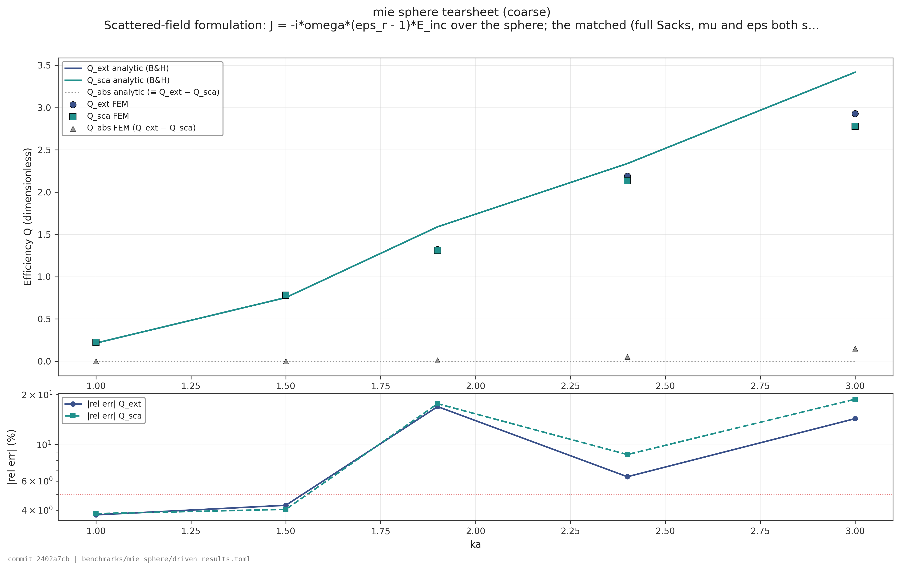
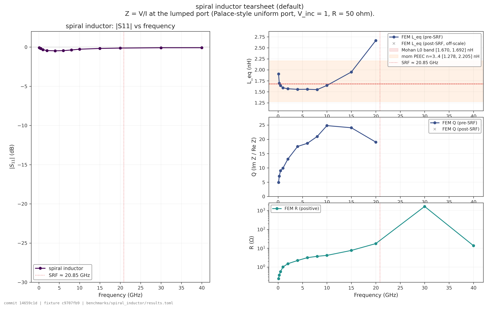
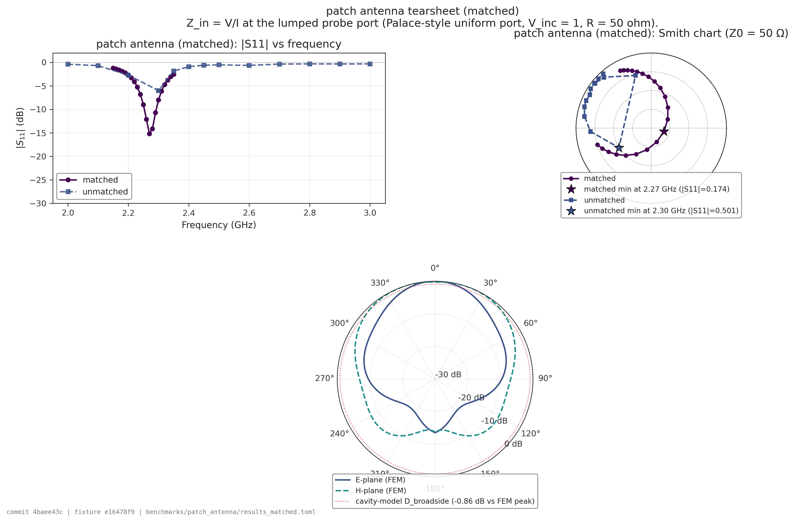
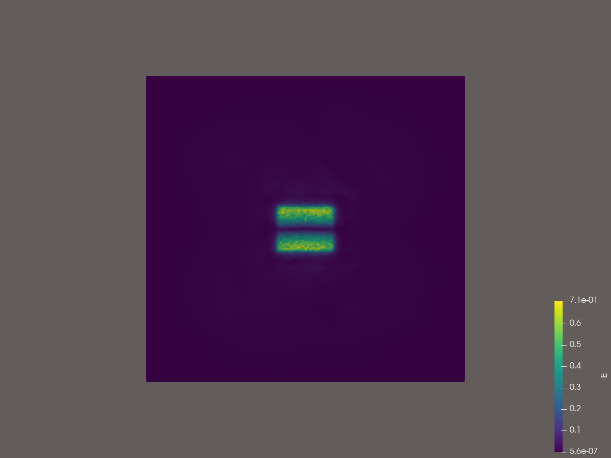
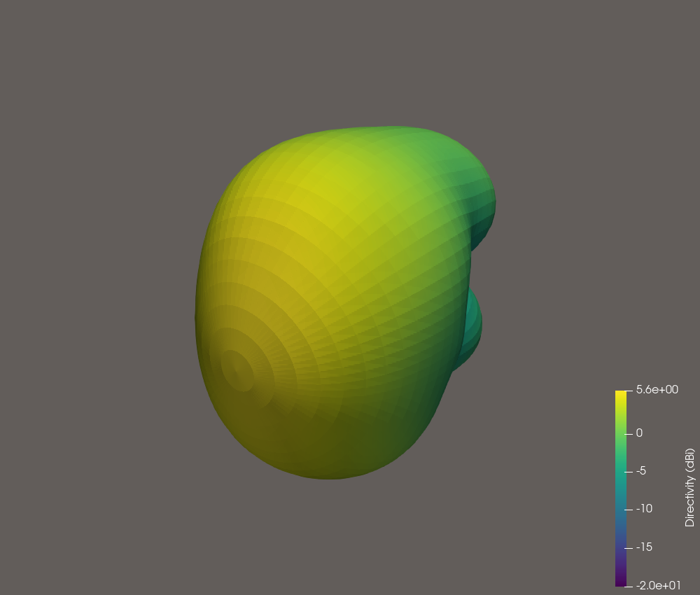

# GEODE-FEM

**GPU-accelerated Electromagnetic Open Differentiable Engine — FEM/DG**

> Status: driven + eigenmode FEM with multi-mode wave ports landed. End-to-end
> stack (mesh I/O → P1 + Nédélec kernels → autodiff-preserving sparse `[nnz]`
> assembly → direct LU and Krylov COCG + ILU(0) solvers → PEC / Silver-Müller /
> matched UPML / Leontovich / lumped + multi-mode wave ports → S-parameter and
> NTFF extraction) is on `main`, validated across five benchmarks: Mie sphere
> (eigenmode + driven scattering), patch antenna (S11 / bandwidth / NTFF /
> efficiency), spiral inductor (L/Q), and the SLCFET 3HP capstone. See
> **Highlights** below.

GEODE-FEM is a [Burn](https://burn.dev)-based Rust implementation of a high-order
finite-element / discontinuous-Galerkin electromagnetic solver. It targets the
same use cases as [AWS Labs Palace](https://awslabs.github.io/palace/stable/) —
eigenmode analysis, frequency-domain driven simulation, time-domain — but built
natively on a differentiable tensor IR with GPU acceleration as a first-class
concern.

## Why

Palace is a state-of-the-art open-source FEM EM solver, but its C++/MFEM-based
implementation predates the era of tensor IRs with differentiable, multi-backend
GPU compilers. Expressing the same operators on top of
[Burn](https://github.com/tracel-ai/burn) unlocks:

- **Hardware portability** without per-backend kernels: CUDA, ROCm, Metal,
  Vulkan, WebGPU
- **Differentiable physics** for inverse design and topology optimization
- **Kernel fusion** across FEM stencils via Burn's JIT compiler
- **Rust** end-to-end: solver, geometry, mesh, I/O — no Python boundary

## Project family

GEODE-FEM is one of three complementary projects:

| Project | Role | Discretization | Status |
|---|---|---|---|
| [crutcher/palace_whiteroom](https://github.com/crutcher/palace_whiteroom) | Clean-room dissection of Palace into a layered specification (L1–L4) | FEM/DG (target) | Active analysis |
| [rjwalters/geode-fem](https://github.com/rjwalters/geode-fem) | Burn-based realization of the whiteroom L4 specification | FEM/DG | Driven + eigenmode; 5-benchmark suite; multi-mode wave ports |
| [rjwalters/strata-fdtd](https://github.com/rjwalters/strata-fdtd) | FDTD time-domain solver (acoustic today, EM in progress) | FDTD | Active |

Strata and GEODE-FEM are sister codebases that use **different discretizations**
for **overlapping physics**. Mie resonances are the canonical cross-check
benchmark — analytical Mie series ↔ strata FDTD ↔ GEODE-FEM eigenmode.

## Highlights

| | |
|---|---|
| **Mie eigenmode** | Lowest TM_1,1 mode (n=1.5 dielectric sphere, R/R_buffer=1/2, PEC outer + anisotropic UPML buffer): FEM Re(k) ≈ 1.229 vs analytic 1.30343, **~5.7% rel err / Q ≈ 27** on the bundled 774-node fixture. PR #60's anisotropic UPML (#54) broke the 16% scalar-PML reflection ceiling diagnosed in #52. |
| **Mie driven scattering** | Plane-wave scattered-field driven solve with matched (full Sacks) UPML; `Q_ext` via the volume optical theorem, `Q_sca` via Poynting flux, both vs the analytic Mie series. **Below 5% rel err** on the fine on-resonance fixture (#224); the coarse 774-node fixture is mesh-dominated at high ka. See [`benchmarks/mie_sphere/driven_results.toml`](benchmarks/mie_sphere/driven_results.toml). |
| **Patch antenna** | Probe-fed FR-4 patch (W/L/h = 38/29/1.6 mm, ε_r=4.4) with matched box-UPML and a Palace-style lumped probe port: f_res ≈ 2.27 GHz, **S11 dip −15.2 dB, −10 dB BW 38.7 MHz (1.71%)**, η ≈ 29 % on the impedance-matched fixture (#237). NTFF via Love-equivalence yields directivity / gain (#229). vs Balanis cavity-model oracle (`geode_core::patch_cavity`). See [`benchmarks/patch_antenna/results_matched.toml`](benchmarks/patch_antenna/results_matched.toml). |
| **Spiral inductor** | 3.5-turn generic square spiral (54,428 edges) with Leontovich surface-impedance conductors: L extracted from `Im(Z)/ω` across a frequency sweep, **within −4.9 % of Mohan analytic and −6.8 % of MoM PEEC** at 1 GHz. See [`benchmarks/spiral_inductor/results.toml`](benchmarks/spiral_inductor/results.toml). |
| **SLCFET 3HP capstone** | 3-turn Au-on-SiC square spiral (76,964 edges) on the high-ε_r SiC substrate: f→0 quasi-static L₀ via Richardson extrapolation, **−2.1 % vs MoM PEEC, +2.8 % vs Mohan** — meeting the 5 % bar (#212). FEM correctly resolves substrate-C dispersion the analytic oracles omit. |
| **Wave ports** | Multi-mode wave-port BC with rank-N SMW augmentation and block S-matrix (A1+B1+C1+C2, #254/#255/#256/#257). 2D transverse modal eigensolver (#240, generalized to non-rectangular cross-sections in #265), bi-modal straight-section and height-step mode-matching cross-checks. |
| **Iterative solver** | Krylov COCG with Jacobi (#238) and ILU(0) (#267) preconditioners, wired through `driven_frequency_sweep` and `solve_wave_port_sweep` (#264). Sparse `[nnz]` Nédélec assembly (#218) lifted the prior 46k-edge dense-scatter cap. ILU(0) cuts iterations 2.4× on the σ-damped stress fixture vs Jacobi. |
| **Math correctness** | M_{ij} = ∫ N_i · N_j ε(x) dV is **complex-symmetric** (M^T = M), not Hermitian (M^H ≠ M) — the Mie inner product is bilinear, not sesquilinear. Caught during PR #55, validated by empirical check (`Im(v^H M v) ≈ −58`) and by-hand derivation. ILU(0) for COCG preserves the bilinear form (#267). |
| **Validated chain** | 200+ PRs merged. Scalar Helmholtz cube modes, batched P1 + Nédélec local kernels with autodiff through assembly, dense (`faer::generalized_eigen`) and sparse (shift-and-invert Lanczos, complex-symmetric variant for the Mie pencil) eigensolvers, ARPACK fallback driver (`--features arpack`), all four absorbing-BC families above, Palace 3D oracle slots for patch (#239) and spiral (#266). |

## Visualizations

Each benchmark family ships a one-command **tearsheet** that overlays the FEM
result on its analytic / empirical oracle. Regenerate any of them with:

```sh
python -m geode_viz.scripts.plot_benchmark <mie_sphere|spiral_inductor|patch_antenna> --tearsheet
```

(See [`tools/viz/`](tools/viz/) for the full plotting + VTK/ParaView export
pipeline — Epic #276.)

**Mie sphere** — scattering efficiencies `Q_ext` / `Q_sca` vs size parameter
`ka`, against the Bohren & Huffman analytic series, with a per-point
relative-error strip.



**Spiral inductor** — `|S11|` plus extracted `L` / `Q` / `R` vs frequency,
bracketed by the Mohan analytic band and the MoM PEEC range, with the
self-resonant frequency marked.



**Patch antenna** — the `|S11|` resonance dip, the input-impedance Smith
chart, and the E-/H-plane radiation-pattern cuts (dB) against the Balanis
cavity-model directivity oracle.



### 3D field & radiation pattern (via ParaView)

The driven solver can export its volumetric `E(r)` and the NTFF radiation
lobe as VTK `.vtu` files, rendered headlessly with ParaView's `pvbatch`:

```sh
# Near-field |E| on the patch resonance, then a z-slice render
cargo run -p geode-core --release --example patch_antenna -- --export-field artifacts/viz/E_patch.vtu
pvbatch tools/viz/geode_viz/scripts/pvbatch_render.py artifacts/viz/E_patch.vtu --out E_patch_slice.png

# 3D directivity lobe (open in ParaView, colour by D_dB)
cargo run -p geode-core --release --example patch_antenna -- pattern-3d --out artifacts/viz/patch_lobe.vtu
```

| Near-field `\|E\|` slice | 3D radiation lobe |
|---|---|
|  |  |

The slice resolves the TM₀₁ cavity mode — field maxima at the patch's two
radiating edges — while the lobe shows the broadside main beam peaking at
≈ 5.6 dBi.

## Roadmap

### v0 (closed)

- [x] Cargo workspace skeleton with Burn dependency
- [x] Scalar Helmholtz on a tetrahedral mesh, vector Nédélec elements
- [x] Dense + sparse complex-symmetric eigensolvers, PEC + Silver-Müller + scalar PML
- [x] Mie sphere eigenmode benchmark vs analytic PEC-cavity catalog

### v1 (closed)

- [x] **Anisotropic UPML** (#54) — broke the 16 % scalar-PML reflection ceiling
- [x] **Vector-tracking k₀** (#48) — self-consistent Newton on the Silver-Müller pencil
- [x] **Matched (full Sacks) UPML** lifted into Burn assembly + driven solve (#205, #223)
- [x] **Deterministic driven solve** `A(ω)x = b` with volumetric current source (#194/#197)
- [x] **Frequency sweep + extraction** Z(ω) → L/R/Q/S11 (#209), N-port S-matrix (#219)
- [x] **Lumped ports + Leontovich BC** for driven simulation (#206, #207)
- [x] **Driven Mie scattering benchmark** Q_ext / Q_sca vs analytic series (#195/#200)

### v2 (recent)

- [x] **Sparse `[nnz]` Nédélec assembly** for driven path — lifts the 46k-edge dense-scatter cap (#220)
- [x] **Patch antenna benchmark** S11 / bandwidth / NTFF / efficiency (#231–#237)
- [x] **Spiral inductor benchmark** L/Q vs Mohan + MoM PEEC (#211/#225)
- [x] **SLCFET 3HP capstone** Au-on-SiC spiral, quasi-static L₀ vs MoM within 5 % (#212/#230)
- [x] **Wave-port BC** with rank-N SMW augmentation + block S-matrix (#234/#245)
- [x] **Multi-mode wave ports** (A1 + B1 + C1 + C2) + analytic mode-matching (#254/#255/#256/#257)
- [x] **2D transverse modal eigensolver** for general cross-sections (#240/#265)
- [x] **Krylov COCG iterative solver** + Jacobi (#238) and ILU(0) (#267) preconditioners
- [x] **Iterative path wired through sweep pipelines** with `solver_mode` knob (#264)
- [x] **Palace 3D oracle integration** for patch antenna (#239) and spiral inductor (#266)
- [x] **Visualization tooling** — benchmark tearsheets + VTK `.vtu` field export + headless ParaView render (Epic #276)
- [ ] **Whiteroom L4 mapping** (#5) — operator-only tracker, ongoing

## Build

Requires Rust stable (1.95+, set in `rust-toolchain.toml`).

```sh
cargo build              # builds workspace with default `wgpu` backend
cargo test               # runs the GPU smoke test
cargo run --bin geode    # prints backend / device / smoke result
```

### Backend selection

`geode-core` selects one Burn backend at compile time via mutually-exclusive
features:

```sh
# default — wgpu (Metal on macOS, Vulkan on Linux, DX12 on Windows)
cargo build

# CUDA (requires a CUDA toolkit and an NVIDIA GPU)
cargo build -p geode-core --no-default-features --features cuda
```

Enabling both `wgpu` and `cuda`, or neither, is a hard compile error — see
`compile_error!` guards in `crates/geode-core/src/lib.rs`.

## System dependencies

The default build is **pure Rust**: backend GPU drivers (Metal, Vulkan, CUDA,
etc.) aside, no system Fortran/BLAS libraries are required. In particular,
sparse generalized eigensolves use a built-in shift-and-invert Lanczos
(`SparseShiftInvertLanczos`) that depends only on `faer`'s sparse LU.

### Optional `arpack` feature

The opt-in `arpack` Cargo feature switches in an ARPACK-backed driver
(`ArpackEigensolver`) as a canonical reference alongside the in-tree
Lanczos. The Lanczos remains the default; ARPACK never becomes the
default by design (issue #24 non-goal). FFI bindings to `dsaupd_c` /
`dseupd_c` (the stable ARPACK ICB C wrappers, available since arpack-ng
3.7) are vendored inline in `crates/geode-core/src/arpack.rs`, so no
`bindgen` / `clang` / `gfortran` toolchain is required at build time —
the only build-time work is `pkg-config`-based discovery of the system
`libarpack`.

Install one of:

```sh
# macOS (Homebrew)
brew install arpack pkg-config

# Debian / Ubuntu
sudo apt-get install -y libarpack2-dev pkg-config
```

Then build / test with the feature:

```sh
cargo build --features arpack -p geode-core
cargo test  --features arpack -p geode-core --release \
    --test sparse_eigensolver -- --ignored
```

If `pkg-config` cannot find `libarpack` on your system, you can point
the build script at it manually:

```sh
ARPACK_LIB_DIR=/opt/homebrew/opt/arpack/lib \
    cargo build --features arpack -p geode-core
```

Set `ARPACK_STATIC=1` to request static linking (only useful if your
`libarpack.a` is in the search path; Homebrew ships the dylib only).

The Homebrew `arpack` formula does ship the ICB C headers under
`$(brew --prefix arpack)/include/arpack/` and a working pkg-config file
— we use neither, since our FFI declarations are vendored. The header
story that motivated the original opt-in framing (a quirk in
`arpack-ng-sys` where its `system` feature can't resolve
`<arpack/arpack.h>` because Homebrew's `arpack.pc` sets `includedir`
one level too deep) is documented in `crates/geode-core/src/arpack.rs`.

### Workspace layout

```
crates/
  geode-core/        # FEM kernels, assembly, eigensolvers, driven solve,
                     # ports / BCs, S-parameter + NTFF extraction,
                     # benchmark examples and integration tests
  geode-cli/         # `geode` binary — prints device info and runs the smoke op
  geode-validation/  # cross-backend reference tests (NumPy / JAX / Julia /
                     # ONNX / TF-Java) and analytic-oracle gates
```

Benchmarks under [`benchmarks/`](benchmarks/) (one subdirectory per fixture)
carry auto-generated `results*.toml` files paired with `tests/` cases that
either compare within a documented tolerance band or skip-with-note when an
external oracle (e.g. Palace) is `pending_operator_run`.

## Regression fixtures

Numerical baselines for the unit-cube Dirichlet Laplacian ground-mode
sweep are committed under
`crates/geode-core/tests/fixtures/cube_convergence.toml`. The values are
**not** analytic targets; they record what the current assembly +
`faer` eigensolver produces today. Their job is to catch unintended
regressions when assembly or the eigensolver change.

The diff-check test lives at
`crates/geode-core/tests/cube_convergence_regression.rs`. It is
`#[ignore]`d for the same reason as the other eigensolver tests:
faer 0.24's `gevd::qz_real` panics under debug-assertions. Run with:

```sh
# Run the regression diff-check (and all other ignored faer tests):
cargo test -p geode-core --release -- --ignored

# Run only the convergence regression:
cargo test -p geode-core --release \
    --test cube_convergence_regression -- --ignored
```

If an intentional change (e.g. mass-lumping, eigensolver swap) shifts
the per-level eigenvalues beyond the `1e-4` relative tolerance,
regenerate the fixture and commit it alongside the code change:

```sh
cargo run -p geode-core --release \
    --example regen_cube_convergence_fixture
```

Call out the regeneration in the PR description so reviewers know the
baseline drift is intentional.

## Performance baseline

A `criterion`-based bench harness lives under
[`crates/geode-core/benches/`](crates/geode-core/benches). It establishes
a wall-clock baseline for the FEM pipeline so future performance
work has something to push against. The current numbers (Apple Silicon,
default `wgpu` backend) are committed to
[`benchmarks/perf/baseline.toml`](benchmarks/perf/baseline.toml).

**Reproduce the measurements:**

```sh
# Runs all 5 benches; total wall-clock ≈ 25-30 min on M-series hardware,
# dominated by the Mie end-to-end (~70-90 s per sample × 10 samples).
cargo bench -p geode-core
```

Criterion writes per-bench HTML reports under `target/criterion/`
(gitignored). Extract a clean TOML summary (medians + median-absolute-
deviation as an IQR proxy) with:

```sh
cargo run -p geode-core --example extract_baseline
```

This walks `target/criterion/<bench>/<input>/new/estimates.json` and
overwrites `benchmarks/perf/baseline.toml`. The extractor is **not**
wired into `cargo bench` itself — re-running the analysis is then a
side-effect-free second step.

**Per-stage cost (n=10 cube; May 2026 baseline, pre-sparse-`[nnz]`):**

| stage                              | median   |
| ---------------------------------- | -------- |
| `assemble_global_p1`               |  45 ms   |
| `assemble_global_nedelec` (real)   | 289 ms   |
| `assemble_global_nedelec` (cmplx)  | 407 ms   |
| `FaerDenseEigensolver`             |  5.95 s  |
| `SparseShiftInvertLanczos`         |  52 ms   |

Dense `generalized_eigen` dwarfs every other stage by ~100×. The
pure-Rust sparse shift-and-invert Lanczos (faer sparse LU) brings the
eigensolve down to roughly the same order as the Burn-side assembly.

**Mie sphere end-to-end (774-node refined fixture, complex pencil):**

| solver path                                | median  |
| ------------------------------------------ | ------- |
| `FaerComplexEigensolver` (dense)           | 126.1 s |
| `SparseComplexShiftInvertLanczos` (sparse) | **4.07 s** |

**31× speedup at this scale; 107× on the original 313-node fixture.**
The sparse path is now the default in `examples/mie_sphere.rs`; pass
`--dense` for the correctness-oracle cross-check.

**Scaling beyond the dense-scatter cap.** The numbers above are from
the original dense Nédélec scatter path. Sparse `[nnz]` pattern-slot
assembly (#220) lifted the ~46 k-edge ceiling that pipeline hit, so
the driven path (`driven_solve`, `driven_frequency_sweep`,
`solve_wave_port_sweep`) now exercises fixtures into the 10⁵-edge
range — the spiral inductor (54 k edges) and SLCFET 3HP (77 k edges)
benchmarks run on it directly. The Krylov COCG iterative solver
(#243) and ILU(0) preconditioner (#267) provide a memory-frugal
alternative for fixtures the direct LU can't factor; both are
wired through the sweep pipelines under a `solver_mode` knob (#264).
The per-stage cost table above will be regenerated as part of the
next perf-baseline refresh; for now it stands as a known-stale but
documented reference point.

### Mie sphere (issue #4)

The project's stated north-star validation problem: FEM eigenmodes of a
dielectric sphere (refractive index `n = 1.5`, radius `R = 1`) inside a
vacuum buffer (`r ≤ R_buffer = 2`) terminated by an **anisotropic UPML**
(issue #54, default since issue #61), compared against analytic resonance
roots. The legacy scalar-isotropic PML is retained as `--scalar-pml` for
cross-check.

Run the benchmark:

```sh
cargo run -p geode-core --release --example mie_sphere                # anisotropic UPML, sparse (defaults)
cargo run -p geode-core --release --example mie_sphere -- --dense     # anisotropic UPML, dense oracle
cargo run -p geode-core --release --example mie_sphere -- --scalar-pml # legacy 16% baseline cross-check
```

This prints a comparison table and writes
[`benchmarks/mie_sphere/results.toml`](benchmarks/mie_sphere/results.toml)
with the lowest 8 FEM modes paired against the extended analytic
catalog. The benchmark uses the **PEC-cavity dielectric resonator**
as the analytic ground truth (a closed cavity with PEC at `r = R_buffer`,
which is the limit the FEM hits as the PML absorption strength `σ₀ → 0`);
the open-space Mie WGM positions — which require Hankel functions and
complex Newton iteration — are tracked under #33. The driven
scattering (`Q_ext`, `Q_sca` vs. `ka`) cross-check is the companion
benchmark `examples/mie_driven_scattering.rs` (issue #195), which
writes
[`benchmarks/mie_sphere/driven_results.toml`](benchmarks/mie_sphere/driven_results.toml).

**Mesh**: bundled 774-node / 3335-tet fixture (`tests/fixtures/sphere.msh`,
regenerated from `mesh_scripts/sphere.geo` via Gmsh CLI). Layered into
`sphere_interior` (`r ≤ 1`) + `vacuum_gap` (`1 < r ≤ 1.5`) + `pml_shell`
(`1.5 < r ≤ 2`) + boundary triangles.

**Catalog**: roots for angular orders `l ∈ [1, 4]`, both TE and TM
polarisations, lowest 5 radial overtones each (~40 entries). Each
root carries its `(l, n, polarisation, multiplicity = 2l+1)` label.

**Mode classification**: walks the catalog in ascending `k` and for
each analytic root claims the next `2l + 1` consecutive FEM modes
(sorted by `Re(k)`), producing an unambiguous `(l, n, pol, m_idx)`
label per mode. On the bundled fixture (anisotropic UPML default)
this identifies the lowest 3 FEM modes as the TM_1,1 triplet
(Q ≈ 27) and the next 3 as TE_1,1 (rel err ≲ 2.5%).

**Current numbers** (bundled fixture, anisotropic UPML default,
σ₀ = 5.0, k₀_ref = 2.0):

| mode    | analytic kR | FEM Re(kR) | rel err Re(k) | Q     |
| ------- | ----------- | ---------- | ------------- | ----- |
| TM_1,1  | 1.30343     | ≈ 1.229    | ≈ 5.7%        | ≈ 27  |
| TE_1,1  | 1.88943     | ≈ 1.872 – 1.934 | ≈ 0.7 – 2.3% | ≈ 9 – 50 |

For comparison, the legacy `--scalar-pml` path produces TM_1,1 at
~16.2% rel err / Q ≈ 5.8 — the h-independent reflection floor
diagnosed in issue #52 and broken by issue #54's anisotropic UPML.

**Why anisotropic helps** (issue #52 → #54). Under the scalar-isotropic
PML the TM_1,1 / TE_1,1 / TM_2,1 modes ALL sat at ~16% rel err
independent of mesh refinement — the signature of an h-independent
reflection floor at the inner PML interface, not a discretization
error. A diagonal anisotropic permittivity tensor in the global
Cartesian basis, `ε_α = (1/s_r) r̂_α² + s_t (1 - r̂_α²)` per centroid
radial unit vector `r̂`, absorbs along the propagation direction in
a direction-aware way and removes the reflection floor. Available via
[`assemble_global_nedelec_with_anisotropic_epsilon`] and
[`build_anisotropic_pml_tensor_diag`]; default in `examples/mie_sphere.rs`
since issue #61.

**On the "full rotation" follow-up.** For the current PML profile
`s_r = s_t = 1 - jσ/ω` the off-diagonal terms of the rotated tensor
`R · diag(1/s_r, s_t, s_t) · R^T` are *identically zero*, so the
diagonal-only kernel is mathematically exact (not an approximation)
for this profile. The full off-diagonal kernel only matters when the
radial and tangential profiles diverge (e.g., CFS-PML or split-field
formulations), and is tracked as a future ticket against those
profiles, not against the present implementation.

**Vector-tracked self-consistent k₀** (issue #48): the Silver-Müller
absorbing BC matches its impedance to a single guess `k₀`; the
resulting Q is dominated by impedance mismatch when `k₀` is far from
`Re(k_target)`. PR #47 added a damped Newton iteration with a frozen
integer index, which improved Q only marginally (≈ 0.54) because the
177-mode Whitney spurious cluster re-shuffles as `k₀` drifts and the
integer-index target drifts off the physical mode. The vector-tracked
variant (`self_consistent_k_vector_tracked` in
`silvermuller_self_consistent.rs`) instead selects, at every Newton
iteration, the mode whose **eigenvector** has maximum bilinear-M
overlap with the prior iteration's target — metric-consistent with the
complex-symmetric mass matrix. Mode death is surfaced as a dedicated
`SelfConsistentResult::ModeLost` variant when the maximum overlap
falls below 0.5 (signalling the seed is far from any physical
resonance). This is the unblocker for tightening Q-factor agreement
on the Silver-Müller path; full convergence and Q comparison runs
live under `tests/silvermuller_self_consistent_vector_tracking.rs`
(`#[ignore]`'d, faer-dense-release-only).

The same physical problem is computed in the time domain by the sister
project [`rjwalters/strata-fdtd`](https://github.com/rjwalters/strata-fdtd)
via FDTD; eigenfrequency-level cross-validation across the two
discretizations is the goal of this benchmark family.

The acceptance test (`crates/geode-core/tests/mie_sphere.rs`) asserts
(a) the lowest FEM mode's `Re(k)` agrees with the analytic TM_1,1
root to within **8%** at the bundled fixture's resolution under the
anisotropic-UPML default (tightened from 25% per issue #61 after
#54 broke the scalar 16% ceiling), and (b) the lowest TM_1,1
triplet's median Q is above 1.5 — a regression catch for PML
mis-configuration (σ₀ drift, mask break, vacuum-gap removal). The
present median Q on the anisotropic path is ≈ 27.

## License

MIT
