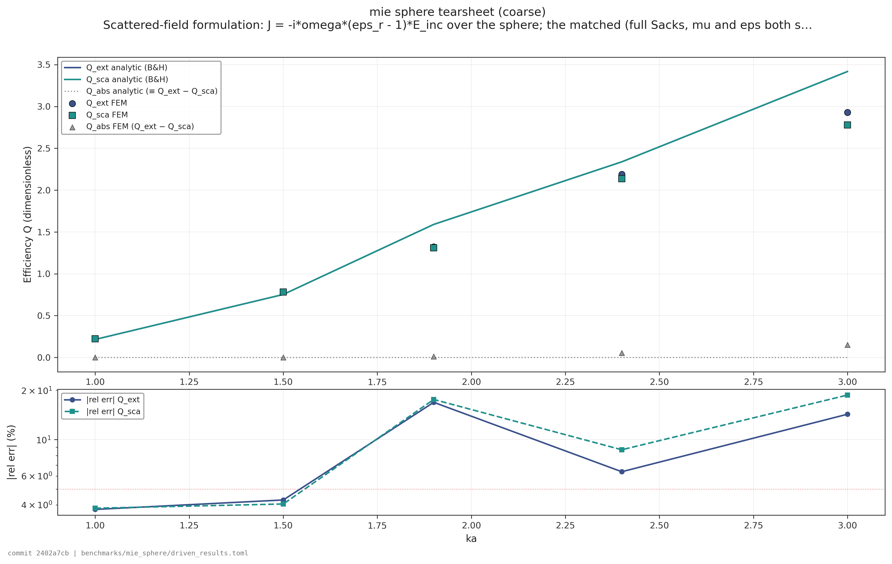
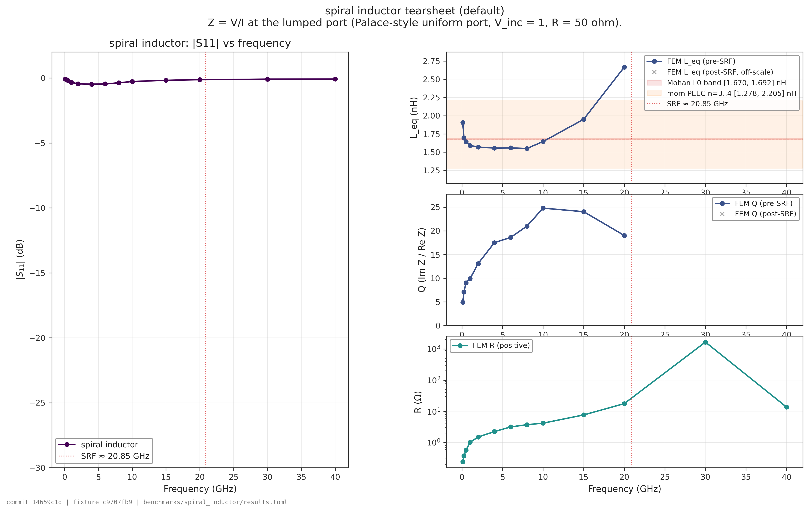
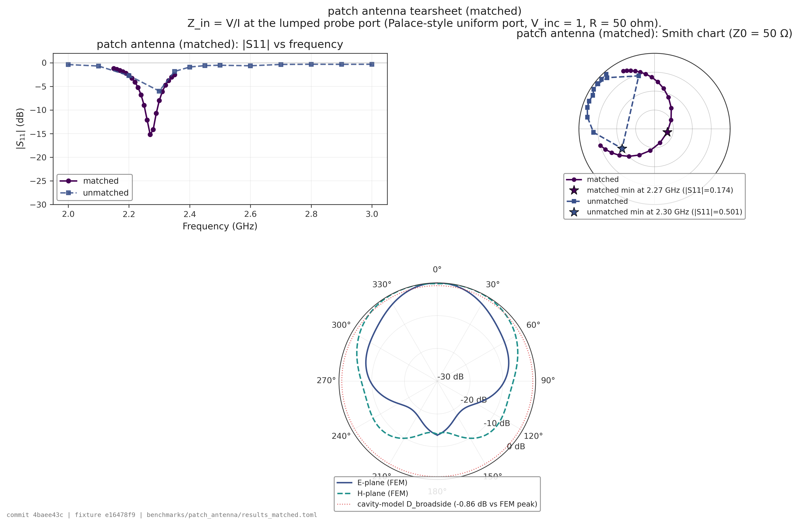
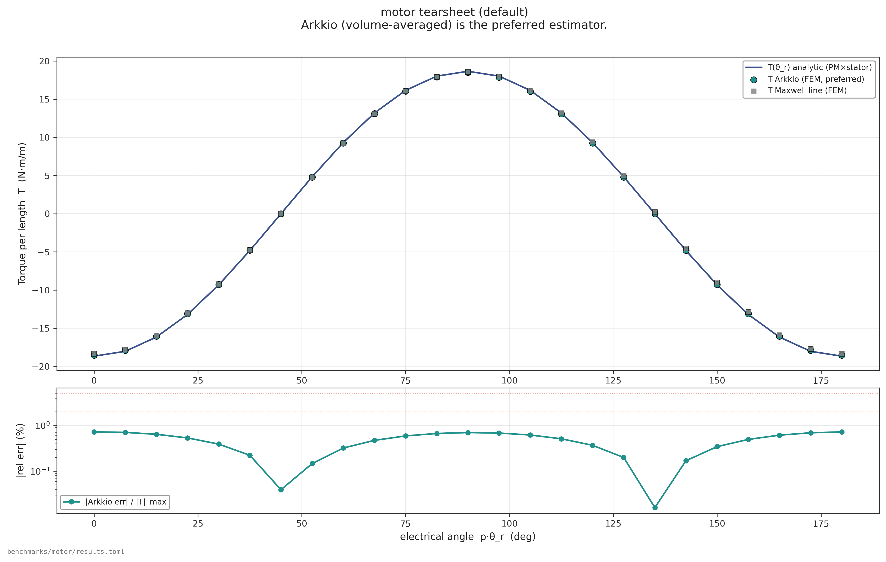
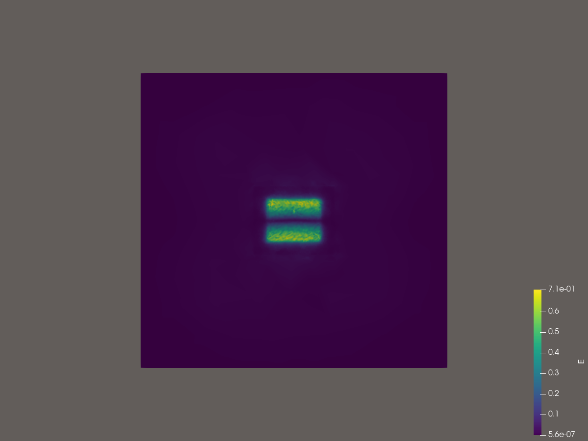
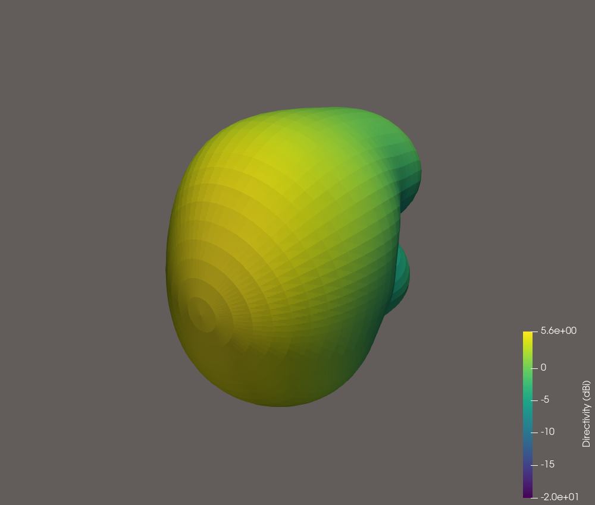

# GEODE-FEM

**GPU-accelerated Electromagnetic Open Differentiable Engine — FEM/DG**

> Status: driven + eigenmode FEM with multi-mode wave ports landed. End-to-end
> stack (mesh I/O → P1 + Nédélec kernels → autodiff-preserving sparse `[nnz]`
> assembly → direct LU and Krylov COCG + ILU(0) solvers → PEC / Silver-Müller /
> matched UPML / Leontovich / lumped + multi-mode wave ports → S-parameter and
> NTFF extraction) is on `main`, validated across five benchmarks: Mie sphere
> (eigenmode + driven scattering), patch antenna (S11 / bandwidth / NTFF /
> efficiency), spiral inductor (L/Q), and the SLCFET 3HP capstone. See
> **Highlights** below.

GEODE-FEM is a [Burn](https://burn.dev)-based Rust implementation of a high-order
finite-element / discontinuous-Galerkin electromagnetic solver. It targets the
same use cases as [AWS Labs Palace](https://awslabs.github.io/palace/stable/) —
eigenmode analysis, frequency-domain driven simulation, time-domain — but built
natively on a differentiable tensor IR with GPU acceleration as a first-class
concern.

## Why

Palace is a state-of-the-art open-source FEM EM solver, but its C++/MFEM-based
implementation predates the era of tensor IRs with differentiable, multi-backend
GPU compilers. Expressing the same operators on top of
[Burn](https://github.com/tracel-ai/burn) unlocks:

- **Hardware portability** without per-backend kernels: CUDA, ROCm, Metal,
  Vulkan, WebGPU
- **Differentiable physics** for inverse design and topology optimization
- **Kernel fusion** across FEM stencils via Burn's JIT compiler
- **Rust** end-to-end: solver, geometry, mesh, I/O — no Python boundary

## Project family

GEODE-FEM is one of three complementary projects:

| Project | Role | Discretization | Status |
|---|---|---|---|
| [crutcher/palace_whiteroom](https://github.com/crutcher/palace_whiteroom) | Clean-room dissection of Palace into a layered specification (L1–L4) | FEM/DG (target) | Active analysis |
| [rjwalters/geode-fem](https://github.com/rjwalters/geode-fem) | Burn-based realization of the whiteroom L4 specification | FEM/DG | Driven + eigenmode; 5-benchmark suite; multi-mode wave ports |
| [rjwalters/strata-fdtd](https://github.com/rjwalters/strata-fdtd) | FDTD time-domain solver (acoustic today, EM in progress) | FDTD | Active |

Strata and GEODE-FEM are sister codebases that use **different discretizations**
for **overlapping physics**. Mie resonances are the canonical cross-check
benchmark — analytical Mie series ↔ strata FDTD ↔ GEODE-FEM eigenmode.

## Highlights

| | |
|---|---|
| **Mie eigenmode** | Lowest TM_1,1 mode (n=1.5 dielectric sphere, R/R_buffer=1/2, PEC outer + anisotropic UPML buffer): FEM Re(k) ≈ 1.229 vs analytic 1.18710, **3.6% rel err / Q ≈ 27** on the bundled 774-node fixture (analytic roots corrected in #986; was quoted as 5.7% against 1.30343). PR #60's anisotropic UPML (#54) broke the 16% scalar-PML reflection ceiling diagnosed in #52. |
| **Mie driven scattering** | Plane-wave scattered-field driven solve with matched (full Sacks) UPML; `Q_ext` via the volume optical theorem, `Q_sca` via Poynting flux, both vs the analytic Mie series. **Below 5% rel err** on the fine on-resonance fixture (#224); the coarse 774-node fixture is mesh-dominated at high ka. See [`benchmarks/mie_sphere/driven_results.toml`](benchmarks/mie_sphere/driven_results.toml). |
| **Patch antenna** | Probe-fed FR-4 patch (W/L/h = 38/29/1.6 mm, ε_r=4.4) with matched box-UPML and a Palace-style lumped probe port: f_res ≈ 2.27 GHz, **S11 dip −15.2 dB, −10 dB BW 38.7 MHz (1.71%)**, η ≈ 29 % on the impedance-matched fixture (#237). NTFF via Love-equivalence yields directivity / gain (#229). vs Balanis cavity-model oracle (`geode_core::analytic::patch`). See [`benchmarks/patch_antenna/results_matched.toml`](benchmarks/patch_antenna/results_matched.toml). |
| **Spiral inductor** | 3.5-turn generic square spiral (54,428 edges) with Leontovich surface-impedance conductors: L extracted from `Im(Z)/ω` across a frequency sweep, **within −4.9 % of Mohan analytic and −6.8 % of MoM PEEC** at 1 GHz. See [`benchmarks/spiral_inductor/results.toml`](benchmarks/spiral_inductor/results.toml). |
| **SLCFET 3HP capstone** | 3-turn Au-on-SiC square spiral (76,964 edges) on the high-ε_r SiC substrate: f→0 quasi-static L₀ via Richardson extrapolation, **−2.6 % vs MoM PEEC, +2.2 % vs Mohan** — meeting the 5 % bar (#212). FEM correctly resolves substrate-C dispersion the analytic oracles omit. |
| **Wave ports** | Multi-mode wave-port BC with rank-N SMW augmentation and block S-matrix (A1+B1+C1+C2, #254/#255/#256/#257). 2D transverse modal eigensolver (#240, generalized to non-rectangular cross-sections in #265), bi-modal straight-section and height-step mode-matching cross-checks. |
| **Iterative solver** | Krylov COCG with Jacobi (#238), ILU(0) (#267) and AMS (#744) preconditioners, wired through `driven_frequency_sweep` and `solve_wave_port_sweep` (#264). AMS is the default of the assembled iterative driven solve wherever it is supported, with a warned fallback to Jacobi at p=2, on the matrix-free path and with matched-UPML absorbing regions, and in the CLI also for `Re ε_r ≤ 0` materials and floating PEC conductors (#930; for UPML, `direct` is the robust choice; evidence in [`benchmarks/gpu_driven_scaling/README.md`](benchmarks/gpu_driven_scaling/README.md)). Sparse `[nnz]` Nédélec assembly (#218) lifted the prior 46k-edge dense-scatter cap. ILU(0) cuts iterations 2.4× on the σ-damped stress fixture vs Jacobi. |
| **Math correctness** | M_{ij} = ∫ N_i · N_j ε(x) dV is **complex-symmetric** (M^T = M), not Hermitian (M^H ≠ M) — the Mie inner product is bilinear, not sesquilinear. Caught during PR #55, validated by empirical check (`Im(v^H M v) ≈ −58`) and by-hand derivation. ILU(0) for COCG preserves the bilinear form (#267). |
| **Validated chain** | 200+ PRs merged. Scalar Helmholtz cube modes, batched P1 + Nédélec local kernels with autodiff through assembly, dense (shift-invert: dense LU plus faer's standard Schur QR) and sparse (shift-and-invert Lanczos, complex-symmetric variant for the Mie pencil) eigensolvers, ARPACK fallback driver (`--features arpack`), all four absorbing-BC families above, Palace 3D oracle slots for patch (#239) and spiral (#266). |

## Visualizations

Each benchmark family ships a one-command **tearsheet** that overlays the FEM
result on its analytic / empirical oracle. Regenerate any of them with:

```sh
python -m geode_viz.scripts.plot_benchmark <mie_sphere|spiral_inductor|patch_antenna|motor> --tearsheet
```

(See [`tools/viz/`](tools/viz/) for the full plotting + VTK/ParaView export
pipeline — Epic #276.)

**Mie sphere** — scattering efficiencies `Q_ext` / `Q_sca` vs size parameter
`ka`, against the Bohren & Huffman analytic series, with a per-point
relative-error strip.



**Spiral inductor** — `|S11|` plus extracted `L` / `Q` / `R` vs frequency,
bracketed by the Mohan analytic band and the MoM PEEC range, with the
self-resonant frequency marked.



**Patch antenna** — the `|S11|` resonance dip, the input-impedance Smith
chart, and the E-/H-plane radiation-pattern cuts (dB) against the Balanis
cavity-model directivity oracle.



**Slotless-PM motor** — the locked-rotor torque-vs-angle capstone (Epic #448).
A radially-magnetized surface-PM rotor is driven by a θ-distributed stator
winding sheet `J_z = J0 cos(pθ)`; the resulting PM-vs-stator interaction torque
`T(θ_r) = −(2π L/μ₀)·C_M·G_S·cos(p θ_r)` has an exact closed form, plotted here
against the FEM Arkkio (volume-averaged, preferred) and Maxwell line-integral
estimators over one electrical period. The Arkkio sweep tracks the analytic
oracle to **0.71 % L2** (37.6k-node mesh, ≤ 2 % target met), the error strip
staying under both the 2 % and 5 % guides — Arkkio's volume averaging cancels
the pointwise P1 product noise so the interaction torque clears the target even
though the raw mid-gap field sits at the documented ~2.4 % P1 floor. The
self-torques (pure-PM and pure-stator) are ≈ 0 by symmetry, so the graded number
is the genuine interaction torque, not a mesh-symmetry artifact.



Regenerate the benchmark fixture and field export with:

```sh
cargo run -p geode-core --release --example motor_torque
# → benchmarks/motor/results.toml (sweep) + artifacts/viz/motor/motor_field.vtu
```

The `motor_field.vtu` carries the nodal `A_z` scalar and the per-cell `B` glyph
vector for the θ_r = 0 cross-section. Render the ParaView machine-slice visual
(colour by `A_z`, add a Glyph filter on the cell vector `B`) with:

```sh
pvbatch tools/viz/geode_viz/scripts/pvbatch_render.py \
  artifacts/viz/motor/motor_field.vtu --slice z=0 --field A_z --out motor_field_slice.png
```

### 3D field & radiation pattern (via ParaView)

The driven solver can export its volumetric `E(r)` and the NTFF radiation
lobe as VTK `.vtu` files, rendered headlessly with ParaView's `pvbatch`:

```sh
# Near-field |E| on the patch resonance, then a z-slice render
cargo run -p patch_antenna --release -- --export-field --out-dir artifacts/viz
pvbatch tools/viz/geode_viz/scripts/pvbatch_render.py artifacts/viz/E_patch.vtu --out E_patch_slice.png

# 3D directivity lobe (open in ParaView, colour by D_dB)
cargo run -p patch_antenna --release -- pattern-3d --out-dir artifacts/viz
```

| Near-field `\|E\|` slice | 3D radiation lobe |
|---|---|
|  |  |

The slice resolves the TM₀₁ cavity mode — field maxima at the patch's two
radiating edges — while the lobe shows the broadside main beam peaking at
≈ 5.6 dBi.

## Roadmap

The full roadmap, with epics, sequencing and non-goals, is in **[`docs/ROADMAP.md`](docs/ROADMAP.md)**. In brief:

- **v0.4–v0.7 (released):** the `geode` CLI for EDA flows: `check` / `driven` / `eigen` / `extract`, Touchstone, `geode mesh`, C/L + SPICE, lossy eigen, sensitivities, and the adaptive sweep.
- **v0.8.0 (released 2026-10-04):** physics breadth (Epic #756): dispersive, anisotropic and rough materials; mixed, filled and walled wave ports; and hybrid microstrip/stripline ports (Epic #778).
- **v0.9.0 (in progress):**
  - p=2 accuracy (#836);
  - differentiable EDA and `geode optimize` (#841);
  - adaptive meshing (#835);
  - periodic/Floquet (#837).

  Landed on `main` so far: p=2 driven, eigen and geometric wave ports; N-port ∂S, including designs that move hybrid port faces; CLI N-port sensitivities with shape parameters; the H(curl) error estimator and the adaptive loop; periodic, Bloch and Floquet unit cells. Per-epic status is in [`docs/ROADMAP.md`](docs/ROADMAP.md).

The early internal milestones (v0–v2: Nédélec elements, UPML, driven solves, wave ports, Krylov solvers, the benchmark tearsheets) are recorded in `CHANGELOG.md` and the closed epics.

## Build

Requires Rust stable (1.96+, set in `rust-toolchain.toml`).

```sh
cargo build              # builds workspace with the ndarray f64 CPU backend
cargo test               # runs the test suite (includes backend smoke tests)
```

### Backend selection

The Burn backend is chosen at compile time by the opt-in `wgpu` / `cuda` /
`metal` features of `geode-core` (and the matching features of `geode-cli`).
None of them is on by default: `geode-core`'s only default feature is
`faer-parallel`, so a plain build runs on the `ndarray` f64 CPU backend.

```sh
# default — ndarray f64 CPU backend
cargo build

# wgpu (Metal on macOS, Vulkan on Linux, DX12 on Windows)
cargo build -p geode-core --features wgpu

# CUDA (requires a CUDA toolkit and an NVIDIA GPU)
cargo build -p geode-core --features cuda

# Metal (Apple platforms only; local-only — no Apple CI runner)
cargo build -p geode-core --features metal
```

Enabling more than one backend feature is not an error: a `cfg_select!`
picks the first enabled one in the order `cuda`, `metal`, `wgpu`, falling
back to `ndarray` (see `crates/geode-core/src/testing/mod.rs` and
`crates/geode-cli/src/backend.rs`).

Note the macOS nuance: the opt-in `wgpu` backend **already runs on Metal at
runtime** on macOS (wgpu selects the Metal graphics API there). The opt-in
`metal` feature is different — it pins the Metal graphics API and the MSL
(`cubecl-msl`) shader-compilation pipeline at compile time (`burn::backend::Metal<F, I, B>`
is Burn's alias for `Wgpu<F, I, B>`; geode instantiates it as `Metal<f64>`), rather
than going through wgpu's runtime adapter
selection. It is Apple-only and not exercised on CI (all runners are headless
Linux, which use the `ndarray` CPU backend); verify it locally on Apple hardware
with `cargo test -p geode-core --features metal`.

## System dependencies

The default build is **pure Rust**: backend GPU drivers (Metal, Vulkan, CUDA,
etc.) aside, no system Fortran/BLAS libraries are required. In particular,
sparse generalized eigensolves use a built-in shift-and-invert Lanczos
(`SparseShiftInvertLanczos`) that depends only on `faer`'s sparse LU.

### Optional `arpack` feature

The opt-in `arpack` Cargo feature switches in an ARPACK-backed driver
(`ArpackEigensolver`) as a canonical reference alongside the in-tree
Lanczos. The Lanczos remains the default; ARPACK never becomes the
default by design (issue #24 non-goal). FFI bindings to `dsaupd_c` /
`dseupd_c` (the stable ARPACK ICB C wrappers, available since arpack-ng
3.7) are vendored inline in `crates/geode-core/src/eigen/arpack.rs`, so no
`bindgen` / `clang` / `gfortran` toolchain is required at build time —
the only build-time work is `pkg-config`-based discovery of the system
`libarpack`.

Install one of:

```sh
# macOS (Homebrew)
brew install arpack pkg-config

# Debian / Ubuntu
sudo apt-get install -y libarpack2-dev pkg-config
```

Then build / test with the feature:

```sh
cargo build --features arpack -p geode-core
cargo test  --features arpack -p geode-core --release \
    --test sparse_eigensolver -- --ignored
```

If `pkg-config` cannot find `libarpack` on your system, you can point
the build script at it manually:

```sh
ARPACK_LIB_DIR=/opt/homebrew/opt/arpack/lib \
    cargo build --features arpack -p geode-core
```

Set `ARPACK_STATIC=1` to request static linking (only useful if your
`libarpack.a` is in the search path; Homebrew ships the dylib only).

The Homebrew `arpack` formula does ship the ICB C headers under
`$(brew --prefix arpack)/include/arpack/` and a working pkg-config file
— we use neither, since our FFI declarations are vendored. The header
story that motivated the original opt-in framing (a quirk in
`arpack-ng-sys` where its `system` feature can't resolve
`<arpack/arpack.h>` because Homebrew's `arpack.pc` sets `includedir`
one level too deep) is documented in `crates/geode-core/src/eigen/arpack.rs`.

### Workspace layout

```
crates/
  geode-core/        # FEM kernels, assembly, eigensolvers, driven solve,
                     # ports / BCs, S-parameter + NTFF extraction,
                     # benchmark examples and integration tests
  geode-util/        # pre-core staging layer above geode-core: shared
                     # math / convert / interop / fixture / viz helpers
                     # (Epic #414)
  geode-app/         # shared application spine (logging / verbosity seam)
                     # for the GEODE-FEM example binaries
  geode-cli/         # the `geode` binary: headless JSON/TOML problem spec
                     # in, versioned JSON report out (check / driven /
                     # eigen / extract / capacitance / inductance / mesh /
                     # schema); reference in crates/geode-cli/README.md
  geode-optimize/    # pure-Rust, physics-independent L-BFGS-B + MMA/GCMMA
                     # optimizer core for the design loop (Epic #841, #873)
  geode-validation/  # cross-backend reference tests (NumPy / JAX / Julia /
                     # ONNX / TF-Java) and analytic-oracle gates
```

Benchmarks under [`benchmarks/`](benchmarks/) (one subdirectory per fixture)
carry auto-generated `results*.toml` files paired with `tests/` cases that
either compare within a documented tolerance band or skip-with-note when an
external oracle (e.g. Palace) is `pending_operator_run`.

### Bunsen conventions

`geode-core` depends on [`bunsen`](https://github.com/zspacelabs/bunsen)
(git-pinned, `default-features = false, features = ["std"]`) for
machine-checked tensor **shape contracts**: the `define_shape_contract!` /
`unpack_shape_contract!` / `assert_shape_contract!` family
(`bunsen::contracts::*`) — see `crates/geode-core/src/assembly/p1.rs` for the
template. New tensor-index / sequence code should prefer `bunsen::ops`
(`float_arange`, `float_linspace`, tensor `ClampOp`, `repeat_interleave`) over
hand-rolling the Burn-primitive equivalents. Note that `ClampOp` operates on
`Tensor<B, D>` only; scalar (non-`Tensor`) math is out of scope for this
convention.

## Regression fixtures

Numerical baselines for the unit-cube Dirichlet Laplacian ground-mode
sweep are committed under
`crates/geode-core/tests/fixtures/cube_convergence.toml`. The values are
**not** analytic targets; they record what the current assembly +
`faer` eigensolver produces today. Their job is to catch unintended
regressions when assembly or the eigensolver change.

The diff-check test lives at
`crates/geode-core/tests/cube_convergence_regression.rs`. It used to be
`#[ignore]`d because faer 0.24's generalized real QZ (`gevd::qz_real`)
panicked under debug-assertions. `FaerDenseEigensolver` no longer calls
that QZ (dense shift-invert, #800), and no in-tree solver does (#813).
The test is ignored in debug builds only, because the sweep takes about
105 s there; in release it runs in the default tier. Run with:

```sh
cargo test -p geode-core --release --test cube_convergence_regression
```

If an intentional change (e.g. mass-lumping, eigensolver swap) shifts
the per-level eigenvalues beyond the `1e-4` relative tolerance,
regenerate the fixture and commit it alongside the code change:

```sh
cargo run -p regen_cube_convergence_fixture --release
```

Call out the regeneration in the PR description so reviewers know the
baseline drift is intentional.

## Performance baseline

A `criterion`-based bench harness lives under
[`crates/geode-core/benches/`](crates/geode-core/benches). It establishes
a wall-clock baseline for the FEM pipeline so future performance
work has something to push against. The current numbers (Apple Silicon,
`wgpu` backend, then the default) are committed to
[`benchmarks/perf/baseline.toml`](benchmarks/perf/baseline.toml).

**Reproduce the measurements:**

```sh
# Runs all 5 benches; total wall-clock ≈ 25-30 min on M-series hardware,
# dominated by the Mie end-to-end (~70-90 s per sample × 10 samples).
cargo bench -p geode-core
```

Criterion writes per-bench HTML reports under `target/criterion/`
(gitignored). Extract a clean TOML summary (medians + median-absolute-
deviation as an IQR proxy) with:

```sh
cargo run -p extract_baseline
```

This walks `target/criterion/<bench>/<input>/new/estimates.json` and
overwrites `benchmarks/perf/baseline.toml`. The extractor is **not**
wired into `cargo bench` itself — re-running the analysis is then a
side-effect-free second step.

**Per-stage cost (n=10 cube; May 2026 baseline, pre-sparse-`[nnz]`):**

| stage                              | median   |
| ---------------------------------- | -------- |
| `assemble_global_p1`               |  45 ms   |
| `assemble_global_nedelec` (real)   | 289 ms   |
| `assemble_global_nedelec` (cmplx)  | 407 ms   |
| `FaerDenseEigensolver`             | 141 ms ¹ |
| `SparseShiftInvertLanczos`         |  52 ms   |

¹ Re-measured October 2026 (#813) after the dense solver moved from
faer's generalized real QZ to dense shift-invert (#800), so it is not
from the same run as the other rows: `cargo bench -p geode-core --bench
eigensolve_dense`, Apple Silicon, `RAYON_NUM_THREADS=4`, on a heavily
loaded host (load average 14 to 25), so read it as an upper bound. The
May 2026 QZ figure was 5.95 s.

The dense eigensolve used to dwarf every other stage by ~100×. With
shift-invert it is now the same order as the Burn-side assembly, and
about 3× the pure-Rust sparse shift-and-invert Lanczos (faer sparse LU)
at this size.

**Mie sphere end-to-end (774-node refined fixture, complex pencil):**

| solver path                                | median  |
| ------------------------------------------ | ------- |
| `FaerComplexEigensolver` (dense)           | 126.1 s |
| `SparseComplexShiftInvertLanczos` (sparse) | **4.07 s** |

**31× speedup at this scale; 107× on the original 313-node fixture.**
The sparse path is now the default in `examples/mie_sphere/src/main.rs`; pass
`--dense` for the correctness-oracle cross-check.

**Scaling beyond the dense-scatter cap.** The numbers above are from
the original dense Nédélec scatter path. Sparse `[nnz]` pattern-slot
assembly (#220) lifted the ~46 k-edge ceiling that pipeline hit, so
the driven path (`driven_solve`, `driven_frequency_sweep`,
`solve_wave_port_sweep`) now exercises fixtures into the 10⁵-edge
range — the spiral inductor (54 k edges) and SLCFET 3HP (77 k edges)
benchmarks run on it directly. The Krylov COCG iterative solver
(#243) and ILU(0) preconditioner (#267) provide a memory-frugal
alternative for fixtures the direct LU can't factor; both are
wired through the sweep pipelines under a `solver_mode` knob (#264).
The per-stage cost table above will be regenerated as part of the
next perf-baseline refresh; for now it stands as a known-stale but
documented reference point.

### Mie sphere (issue #4)

The project's stated north-star validation problem: FEM eigenmodes of a
dielectric sphere (refractive index `n = 1.5`, radius `R = 1`) inside a
vacuum buffer (`r ≤ R_buffer = 2`) terminated by an **anisotropic UPML**
(issue #54, default since issue #61), compared against analytic resonance
roots. The legacy scalar-isotropic PML is retained as `--scalar-pml` for
cross-check.

Run the benchmark:

```sh
cargo run -p mie_sphere --release                # anisotropic UPML, sparse (defaults)
cargo run -p mie_sphere --release -- --dense     # anisotropic UPML, dense oracle
cargo run -p mie_sphere --release -- --scalar-pml # legacy 16% baseline cross-check
```

This prints a comparison table and writes
[`benchmarks/mie_sphere/results.toml`](benchmarks/mie_sphere/results.toml)
with the lowest 8 FEM modes paired against the extended analytic
catalog. The benchmark uses the **PEC-cavity dielectric resonator**
as the analytic ground truth (a closed cavity with PEC at `r = R_buffer`,
which is the limit the FEM hits as the PML absorption strength `σ₀ → 0`);
the open-space Mie WGM positions — which require Hankel functions and
complex Newton iteration — are tracked under #33. The driven
scattering (`Q_ext`, `Q_sca` vs. `ka`) cross-check is the companion
benchmark `examples/mie_driven_scattering/src/main.rs` (issue #195;
`cargo run -p mie_driven_scattering --release`), which
writes
[`benchmarks/mie_sphere/driven_results.toml`](benchmarks/mie_sphere/driven_results.toml).

**Mesh**: bundled 774-node / 3335-tet fixture (`tests/fixtures/sphere.msh`,
regenerated from `mesh_scripts/sphere.geo` via Gmsh CLI). Layered into
`sphere_interior` (`r ≤ 1`) + `vacuum_gap` (`1 < r ≤ 1.5`) + `pml_shell`
(`1.5 < r ≤ 2`) + boundary triangles.

**Catalog**: roots for angular orders `l ∈ [1, 4]`, both TE and TM
polarisations, lowest 5 radial overtones each (~40 entries). Each
root carries its `(l, n, polarisation, multiplicity = 2l+1)` label.

**Mode classification**: walks the catalog in ascending `k` and for
each analytic root claims the next `2l + 1` consecutive FEM modes
(sorted by `Re(k)`), producing an unambiguous `(l, n, pol, m_idx)`
label per mode. On the bundled fixture (anisotropic UPML default)
the lowest 3 FEM modes are the TM_1,1 triplet (Q ≈ 27). Since #986
corrected the analytic roots, the catalog puts TM_2,1 (1.81333) below
TE_1,1 (1.86880), while the UPML pencil puts the TE_1,1-like triplet
(Re k ≈ 1.870–1.872, Q ≈ 9) below a quintet at Re k ≈ 1.900–1.934.
The k-ordered walk therefore labels modes 3–7 as TM_2,1 and 8–10 as
TE_1,1, and marks the TM_2,1 rows `?` (close-pair overlap, #43). The
table below groups modes by multiplet (3 vs 5) and Q instead; that
assignment is an inference, not something the example asserts.

**Current numbers** (bundled fixture, anisotropic UPML default,
σ₀ = 5.0, k₀_ref = 2.0):

| mode    | analytic kR | FEM Re(kR) | rel err Re(k) | Q     |
| ------- | ----------- | ---------- | ------------- | ----- |
| TM_1,1  | 1.18710     | ≈ 1.229    | ≈ 3.6%        | ≈ 27  |
| TE_1,1  | 1.86880     | ≈ 1.870 – 1.872 | ≈ 0.06 – 0.19% | ≈ 9 |
| TM_2,1  | 1.81333     | ≈ 1.900 – 1.934 | ≈ 4.8 – 6.7% | ≈ 31 – 48 |

Analytic values are the PEC-cavity roots after #986, which fixed a
crosswise pairing of the TE/TM interface and wall conditions. Before
it the table read TM_1,1 1.30343 (5.7%), TE_1,1 1.88943 (0.9 – 1.0%),
TM_2,1 1.89074 (0.5 – 2.3%). The FEM values did not change.

For comparison, the legacy `--scalar-pml` path produced TM_1,1 at
~16.2% rel err / Q ≈ 5.8 (measured against the pre-#986 root 1.30343;
not re-measured) — the h-independent reflection floor
diagnosed in issue #52 and broken by issue #54's anisotropic UPML.

**Why anisotropic helps** (issue #52 → #54). Under the scalar-isotropic
PML the TM_1,1 / TE_1,1 / TM_2,1 modes ALL sat at ~16% rel err
independent of mesh refinement — the signature of an h-independent
reflection floor at the inner PML interface, not a discretization
error. A diagonal anisotropic permittivity tensor in the global
Cartesian basis, `ε_α = (1/s_r) r̂_α² + s_t (1 - r̂_α²)` per centroid
radial unit vector `r̂`, absorbs along the propagation direction in
a direction-aware way and removes the reflection floor. Available via
[`assemble_global_nedelec_with_anisotropic_epsilon`] and
[`build_anisotropic_pml_tensor_diag`]; default in `examples/mie_sphere/src/main.rs`
since issue #61.

**On the "full rotation" follow-up.** For the current PML profile
`s_r = s_t = 1 - jσ/ω` the off-diagonal terms of the rotated tensor
`R · diag(1/s_r, s_t, s_t) · R^T` are *identically zero*, so the
diagonal-only kernel is mathematically exact (not an approximation)
for this profile. The full off-diagonal kernel only matters when the
radial and tangential profiles diverge (e.g., CFS-PML or split-field
formulations), and is tracked as a future ticket against those
profiles, not against the present implementation.

**Vector-tracked self-consistent k₀** (issue #48): the Silver-Müller
absorbing BC matches its impedance to a single guess `k₀`; the
resulting Q is dominated by impedance mismatch when `k₀` is far from
`Re(k_target)`. PR #47 added a damped Newton iteration with a frozen
integer index, which improved Q only marginally (≈ 0.54) because the
177-mode Whitney spurious cluster re-shuffles as `k₀` drifts and the
integer-index target drifts off the physical mode. The vector-tracked
variant (`self_consistent_k_vector_tracked` in
`silvermuller_self_consistent.rs`) instead selects, at every Newton
iteration, the mode whose **eigenvector** has maximum bilinear-M
overlap with the prior iteration's target — metric-consistent with the
complex-symmetric mass matrix. Mode death is surfaced as a dedicated
`SelfConsistentResult::ModeLost` variant when the maximum overlap
falls below 0.5 (signalling the seed is far from any physical
resonance). This is the unblocker for tightening Q-factor agreement
on the Silver-Müller path; full convergence and Q comparison runs
live under `tests/silvermuller_self_consistent_vector_tracking.rs`
(`#[ignore]`'d, faer-dense-release-only).

The same physical problem is computed in the time domain by the sister
project [`rjwalters/strata-fdtd`](https://github.com/rjwalters/strata-fdtd)
via FDTD; eigenfrequency-level cross-validation across the two
discretizations is the goal of this benchmark family.

The acceptance test (`crates/geode-core/tests/mie_sphere.rs`) asserts
(a) the lowest FEM mode's `Re(k)` agrees with the analytic TM_1,1
root to within **8%** at the bundled fixture's resolution under the
anisotropic-UPML default (tightened from 25% per issue #61 after
#54 broke the scalar 16% ceiling), and (b) the lowest TM_1,1
triplet's median Q is above 1.5 — a regression catch for PML
mis-configuration (σ₀ drift, mask break, vacuum-gap removal). The
present median Q on the anisotropic path is ≈ 27.

## License

MIT
